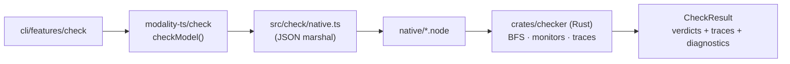
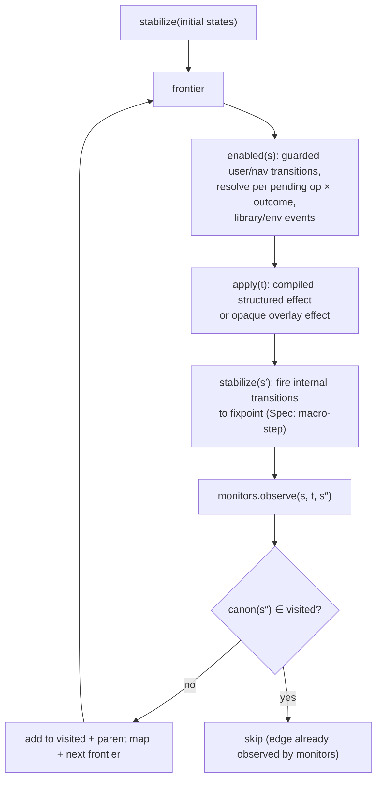

The checker is the **trusted core** of the tool — a wrong checker is worse than no tool.
Its design goals, in priority order, are: **correctness**, **shortest counterexamples**,
**determinism/reproducibility**, and then throughput.

## A native Rust checker, loaded in-process

The checker is implemented in **Rust** (`crates/checker`) and compiled to a Node-API
native addon (`native/modality-checker.<platform>.node`). The TypeScript side
(`src/check/`) is reduced to artifact loading, native-binding invocation, and report
plumbing — `src/check/native.ts` serializes `{ model, properties, options }`, calls the
addon **in-process** (no sidecar, no subprocess), and parses the structured response.



This has two consequences worth stating plainly:

- **Properties are a structured property IR**, not arbitrary TypeScript functions. The
  combinators in `modality-ts/core` build serializable predicate trees
  ([properties](../concepts/properties.md)) that the Rust evaluator interprets. There is
  no `--engine` flag and no TypeScript fallback checker.
- The IR is mirrored on both sides (`src/core/ir/types.ts` ↔ `crates/checker/src/model.rs`)
  and the two must move together — adding an `ExprIR` kind means editing both
  `expr.rs` evaluators.

## Core search: layered BFS over macro-steps

```text
frontier := stabilize*(initialStates); visited := frontier
while frontier ≠ ∅ and depth < maxDepth:
  next := ∅
  for s in frontier (deterministic order):
    for t in enabled(s) (deterministic order):
      for s' in apply(t, s):              # effect nondeterminism
        for s'' in stabilize(s'):         # run-to-completion (may branch)
          monitors.observe(s, t, s'')     # invariants, step, response
          if canon(s'') ∉ visited: add to visited, parents, next
  frontier := next
```



BFS — not DFS/IDDFS — because **shortest counterexamples** are the core DX promise.
Note that `monitors.observe` runs *before* the visited check, so a violating edge between
two already-known states is never missed (this matters for
[step properties](../concepts/properties.md)).

## State representation and canonicalization

A state is a record from var ID to value; the visited set needs a canonical, hashable
form (`crates/checker/src/canon.rs`, `state.rs`, `visited.rs`):

- **Domain-aware canonical encoding** — vars in declaration order, values encoded per
  domain (enums as indices, records field-ordered, `⊥` as a reserved tag, lists
  length-prefixed). Smaller than `JSON.stringify` and immune to key-order accidents.
- **Token symmetry reduction** — `tokens` values are renamed to first-use order *across
  the whole state*, so two states that differ only by which opaque identity is "token 1"
  collapse to one. This is sound (tokens have no semantics beyond equality) and typically
  shrinks the space by the factorial of the token count, while preserving cross-variable
  equality (cache holds the *same* token the session holds).

## Determinism

With sorted iteration orders and no wall-clock dependence, two runs on the same model
produce **identical** results and **identical** counterexamples. This is a hard
requirement for CI reproducibility and for differential testing.

## Monitors

- **`always`** — evaluated on every newly visited stabilized state; first violation (BFS
  ⇒ minimal depth) reconstructs the trace.
- **`alwaysStep`** — evaluated on *every edge*, including edges into visited states.
- **`reachable`** — success is a witness trace; exhaustion is a vacuity warning.
- **`reachableFrom`** — `AG(when → EF goal)`, checked by reverse BFS from goal states
  (`graph.rs`); counterexamples are *non-replayable* by nature (they assert path
  absence), rendered as a trace to the witness `when`-state plus an exhausted-search
  certificate.
- **`leadsToWithin`** — records trigger occurrences during the main BFS, then runs a
  budgeted universal sub-search per trigger state, memoized on `(state, remainingBudget)`
  so cost is near-linear in distinct (state × budget) pairs.

A built-in **vacuity suite** always runs (never-enabled transitions, never-inhabited
enum values, triggers that never fire).

## Slicing

Before searching, each property's read set is computed and the model is sliced to the
**cone of influence** (`src/check/slicing/`): the least fixpoint of the property's reads,
plus variables required by any `enabled(t)`, plus the reads of transitions that write
into the cone. Variables outside the slice are frozen and their transitions dropped for
that property's run; properties with identical slices share one search. `alwaysStep` and
`leadsToWithin` use full-model search (their predicates observe edges broadly). Slicing
is sound exactly because IR footprints are validated over-approximations.

## Limits, diagnostics, and failure modes

The checker enforces configurable [search limits](../guides/diagnostics-and-search-limits.md)
(`maxStates`, `maxEdges`, `maxFrontier`, `memoryGuard`) and emits **diagnostics**:
slicing summary, search summary (max/final frontier, expanded depths, elapsed),
limit reason when a run stops early, and the **dominant variables** by distinct observed
values. Failures are never silent:

| Failure | Handling |
| --- | --- |
| Opaque effect throws / returns invalid state | abort with a modeling error + the offending state |
| Property predicate throws | modeling error (a throwing predicate is a bug, not `false`) |
| Stabilization divergence | modeling error + micro-step trace |
| Visited-set / memory exhaustion | stop with an error verdict + diagnostics; never sample silently |

## Counterexample construction and reporting

From a violation, the parent map (`trace.rs`) is walked back to an initial state,
emitting a `Trace` of steps (transition ID + event label + pre/post + diff). The
[reporter](../soundness/trust-ledger.md) renders a verdict per property
(`verified-within-bounds` / `violated` / `reachable` / `vacuous-warning` / `error`), the
trust ledger, and state-space statistics, as a terminal rendering plus a
schema-versioned `report.json`.

## Performance envelope and specified extensions

The crate includes a parallel-frontier capability (`frontier.rs`, `search.rs`): BFS
layers are embarrassingly parallel, with the visited set sharded by canon-hash. Further
specified-but-deferred work, in order of expected value: partial-order reduction over
`resolve` transitions with disjoint IR footprints, binary visited-set encoding, and an
on-disk frontier for memory-bound runs. Beyond the explicit-state envelope, the answer is
[slicing](../concepts/state-space-control.md), tighter bounds, or
[TLA+ export](../guides/exporting-to-tla.md) — not heroics.

How the checker's *own* correctness is assured is covered in
[Checker correctness](../soundness/checker-correctness.md).
