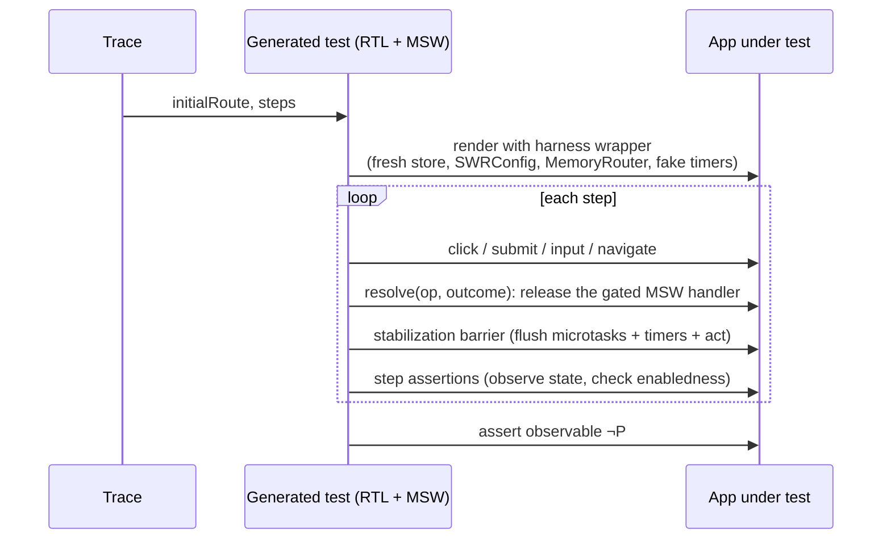

The checker verifies the **model**. This subsystem ties the model to the **app**: it
compiles abstract traces into executable tests, runs them, and classifies the outcome.
It is the safety net for every over-approximation and heuristic — spurious
counterexamples die here instead of in front of a developer's debugger, and model
divergence is detected here instead of silently corroding trust.

## The three replay verdicts

Given a counterexample trace `T` for property `P`:

| Verdict | Meaning | Action |
| --- | --- | --- |
| **reproduced** | the test drives the app along `T` and observes `¬P` | a real app bug; the test file is the regression test |
| **not-reproduced** | the app never violates `P` along `T` (or a step's precondition fails) | model divergence; the report names the diverging step + its extraction provenance |
| **inconclusive** | harness failure (missing locator, provider error, timeout) | infrastructure TODO; counted as neither |

A `not-reproduced` is **not** automatically a model bug to silence — it may be an
over-approximation doing its job (a `havoc`'d transition took a branch the code cannot).
The report distinguishes divergence at an `exact` transition (an extraction defect, high
priority) from divergence at `over-approx`/`manual` transitions (expected slack).

## How a trace becomes a test

The heart of replay fidelity is **ordering control**: every effect-API route is mocked
by a *gated* handler — the request is captured and parked on a deferred promise, and only
the trace's `resolve` step releases it with the chosen outcome. Because
[all model nondeterminism is confined to environment events](../concepts/transitions.md#async-split-transitions),
response *reordering* and *interleaving with user events* are exactly reproducible by
construction. An unexpected extra fetch is parked and reported as a divergence signal.

Before each click/submit, the test asserts the target exists and is **not disabled** —
the model claimed the transition was enabled, so an absent/disabled control is a
divergence at that step, closing the loop with
[guard extraction](./extraction-pipeline.md#p3--handler-discovery).

## The observation problem

The violated predicate is over *model* state; the test must read its concrete
counterpart. Replay and conformance consume **observation providers** from the
registry bundle: each active state source and navigation adapter is wrapped as an
`ObservationProvider` that exposes `setup`, `observe(varId)`, and optional
`witness` hooks. Generated replay harnesses call providers in deterministic
registry order and use the first non-`unobservable` read; when every provider
returns `unobservable`, replay reports a blocking reason that names the var id
and the providers that were tried.

Observability differs by source:

| Source | Observation mechanism | Fidelity |
| --- | --- | --- |
| Jotai / Zustand | observation provider delegates to harness store reads | direct, full |
| SWR cache | harness-provided cache `Map`, inspectable per key | direct, full |
| TanStack Query | fresh `QueryClient` + `QueryClientProvider`; `getQueryState` / `getQueryData` / mutation cache | direct, full |
| route | navigation observation provider / router test API | direct, full |
| `sys:pending` | parked-MSW bookkeeping | direct, full |
| `useState` | **not externally observable** | indirect |

`useState` has two mechanisms, in preference order: (1) a **DOM projection** declared per
var (`observe(...)` reading rendered output — honest but assumes that var's rendering is
correct, which is another layer's job); (2) an opt-in **probe transform** that mirrors
modeled `useState` values into a test-visible registry (full fidelity, zero production
cost, but build machinery — hence opt-in). Properties reading only directly-observable
vars (route guards, cache consistency, pending counts) need no observation declarations,
and the extract-time check tells you which declarations are missing *before* replay.

## Concretization: abstract values → witnesses

Every abstract domain must produce concrete values to drive the app and mock responses.
`enum`/`bool`/`option`/`tagged` tags are trivial literals; `tokens` use a deterministic
**witness factory** per variable (distinct payloads enforced on the pruned-relevant
fields); refined-predicate enums carry a *required* witness obligation per class (an
unconcretizable refinement is rejected at extract time, not replay time); `lengthCat`
uses `[]` / `[w]` / `[w₁,w₂,w₃]`. Concretization need not be faithful to the abstraction
(many concrete values map to one abstract value) — which is why a **reproduced** verdict
is always genuine but a **not-reproduced** may be witness-specific, one more reason it is
advisory.

## Proactive conformance (`modality conform`)

Counterexample replay only exercises traces the checker found violating. `modality
conform` additionally samples N seeded, depth-bounded **random walks** from the state
graph (biased toward `exact` transitions and rarely-covered ones), compiles each into a
test asserting **stepwise agreement** (after every step, all observable vars match the
model), and aggregates mismatches per transition ID. A transition that diverges across
many walks is mis-extracted, and the report ranks these. This is the standing answer to
"how do you know the model still matches the app", and it runs in CI on a budget. The
same machinery doubles as the **SWR template validator**, run against pinned library
versions in the tool's own CI.

## Runtime assertion mode

Because property predicates are evaluable over `ModelState`, a thin dev-build hook can
subscribe to the observable sources (atoms, stores, SWR cache, route) and evaluate the
observable-only invariants on every change during ordinary development and E2E runs — at
near-zero cost. It observes only directly-observable vars and only invariants, but it is
the gentlest adoption on-ramp: teams can run assertions for months before ever running
the checker.

## CI failure policy

One explicit rule: a **violated property whose replay is `not-reproduced`** fails CI
*softly* (annotation, not red) by default — it is a model-maintenance task, and making it
red trains teams to delete properties. A **reproduced** violation is red. Teams harden
this once their model stabilizes. See [CI integration](../guides/ci-integration.md).

## Repository conformance matrix

Inside the `modality-ts` repository, semantic capabilities are tracked in
`test/conformance/matrix.json`:

- **Rows** (`features`) name behavioral contracts — e.g. local setter batching, scope
  mount reset, routing location assignment.
- **Columns** (`targets`) name adapter or library columns — e.g. `react-use-state`,
  `react-router`, `zod`.
- **Supported** cells require at least one canonical fixture under
  `test/conformance/fixtures/<fixture-id>/`.

### Adding a row, fixture, and cell

1. Add a feature row describing the capability.
2. Add a target column when a new source or type-library adapter ships (architecture
   tests require every builtin adapter to appear as a column).
3. Author a minimal fixture app and `fixture.json` with thresholds, budgets, and
   semantic expectations.
4. Mark the cell `supported` and list the fixture id.
5. Run `rtk pnpm ci:conformance`.

The conformance runner uses public CLI command wrappers and writes
`ConformanceMatrixReport` artifacts to temp directories outside fixture roots.

## Real-app canaries

`test/canaries/canaries.json` drives `rtk pnpm ci:canaries`. Canaries exercise local
example apps to find **missing abstraction boundaries** — they are planning signals,
not the primary debugging workflow for every real-app issue.

When a canary fails, read the `CanaryRunReport` classifications: they name a failure
category and suggested plan family. Follow up by adding or extending a canonical
fixture and matrix row when the gap is semantic, not by special-casing the runner.

`rtk pnpm ci:examples` remains the compatibility entrypoint for the demo-app
seeded-bug acceptance canary; thresholds and expectations live in the manifest.

## Thresholds, budgets, and failure classifications

Manifests own threshold and budget fields. Runners delegate comparison to shared gate
helpers in `tools/shared-gates/` — there is no duplicate threshold logic in
compatibility entrypoints.

| Failure category | Meaning | Suggested plan family |
| --- | --- | --- |
| `missing-semantic-abstraction` | behavior not yet modeled abstractly | semantic-typescript-foundation |
| `missing-adapter-capability` | SPI gap for a library | adapter-spi |
| `syntax-recognition-gap` | extraction does not see the syntax | framework-neutral-ir-checker |
| `incorrect-ir-or-checker` | wrong IR or checker semantics | conformance-matrix |
| `state-space-budget` | manifest state-space budget exceeded | state-space-economics |
| `environment-or-project-integration` | project layout, deps, harness | effects-async-environment |
| `explicit-unsupported-behavior` | documented unsupported surface | trust-ledger-docs |
| `fixture-or-canary-invalid` | broken manifest or fixture wiring | real-app-canary |

Budget failures always classify as `state-space-budget`. Manifest budgets may cap
states, edges, depth, frontier, dominant var values, state-space bits, top contributor
bits, and bound hits.

## Runner boundary

Conformance and canary runners under `tools/` must not import private adapter
internals (`src/extract/sources/*` implementation modules). They orchestrate through
`src/cli/*.ts` command wrappers and read structured report artifacts. Architecture
tests enforce this boundary.
