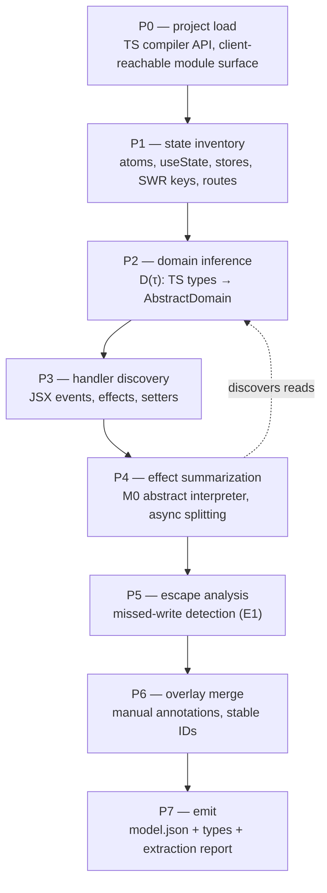

Extraction is the **highest-risk subsystem** — it is where the model can silently
diverge from the app. It is governed by one rule, the
[**E1 soundness invariant**](../soundness/e1-invariant.md):

> For every concrete execution of an app event handler, either the extracted
> transition's successor set covers the abstracted result, **or** the handler is
> classified `unextractable` and surfaced as an overlay TODO. The extractor may
> over-approximate freely; it may never silently under-approximate.

The dangerous direction is a **missed write** to modeled state. Most of the pipeline
exists to detect "this code *might* write modeled state in a way I can't summarize" and
bail out loudly.

## The phases (P0–P7)

P2 and P4 form a fixpoint: field pruning (P2) depends on which fields are read (P4), and
re-runs when properties change.

### P0 — project load and the client-reachable surface

The loader builds a **client-reachable module surface** rather than concatenating every
import of a route file. It constructs a `ts.Program` over reachable sources and exposes
`ts.TypeChecker` for semantic domain inference in later phases. It distinguishes a
**render surface** (modules walked for JSX child components and client islands) from an
**interaction surface** (modules that may contribute event handlers, effects, and
discovered effect APIs). Router adapters classify framework-specific module roles (server
entry exports, `.server` paths, type-only edges), so server-only code does not inflate
the client model. Ambiguous client-reachable imports are **included with warnings**
(E1-safe); imports used only from server roots are excluded.

### P1 — state inventory

Finds `useState` calls (binding the *setter symbol*, not its name), module-level Jotai
`atom()` and utility-atom creators, Zustand `create`/`createStore` stores, `useSWR` call
sites (classifying key shapes), custom hooks (inlined transparently, depth-capped), and
the route manifest (via the [navigation adapter](./navigation.md)). A stateful component
that renders more than once per route (stateful list items) is detected and its vars
downgraded to `unextractable`.

### P2 — domain inference

`D(τ)` maps TypeScript types to [domains](../concepts/state-and-domains.md) using
`ts.TypeChecker` semantic inference as the primary structural source: records, enums,
booleans, tagged unions, and other finite shapes flow from inferred types (including
`z.infer` / `typeof schema.infer` when the checker preserves literals). **Type-library
domain refinement providers** (native aliases, Zod, ArkType) recover constraints
erased from TypeScript — currently static integer bounds on initializer chains; they
are wired through the CLI registry, not embedded in the numeric engine. Record
fields are pruned to those actually read.

### P3 — handler discovery

Resolves transition entry points in decreasing order of confidence: JSX event props on
intrinsic elements; `useEffect`/`useLayoutEffect` bodies (→ `internal` transitions with
`triggeredBy` deps); atom/store setter usages inside handlers; and event props on
component elements (followed *one* level). `disabled`/`aria-disabled` attributes and the
enclosing JSX render condition contribute **guard conjuncts**. Handlers rendered inside
`xs.map(...)` over a `boundedList` generate an **indexed family** of transitions with
positional locators.

### P4 — effect summarization (the M0 subset)

A small abstract interpreter summarizes handler bodies over a defined **M0** statement
and expression subset (`setX(e)`, `setX(p => e)`, atom/store sets, `const` bindings,
`if`/ternary, early return, `await effectApi(...)`, `try/catch` around awaits, and a
catalogue of M0 expressions). Anything outside the subset becomes a per-statement
`havoc`/`choose` of the written variables (over-approx) or, if even the write target is
unidentifiable, a handler-level `unextractable`. Async `await` boundaries are
[split into enqueue + continuations](../concepts/transitions.md#async-split-transitions).

### P5 — escape analysis (the E1 enforcer)

The soundness core. Modeled state is writable only through known channels (`useState`
setters, atom setters, store setters, SWR `mutate`). The analysis computes, per handler,
whether any write channel **escapes** summarization:

- a setter passed to an unanalyzable function ⇒ the variable is **tainted** ⇒ `havoc` at
  handler end (over-approx);
- if the setter escapes *beyond* the handler (stored in a ref, registered as a global
  callback) ⇒ the variable is **globally tainted**: an always-enabled `env` transition
  `external-write(var) = havoc(var)` is added, and the taint is loudly reported;
- an external call that receives no write channel and is not an effect API ⇒ assumed
  pure w.r.t. modeled state (sound for the supported channels).

A plugin that *under*-declares its write channels can only cause taints (noise), never a
silent missed write — see the [plugin SPI](./state-sources.md).

### P6 — overlay merge and stable IDs

Overlay entries override extracted entries of the same ID. An overlay entry matching
nothing is an **error** (catches drift). Every `unextractable` without an overlay entry
or explicit `ignore` is a check-time warning listed in the
[trust ledger](../soundness/trust-ledger.md). Transition/var IDs are
`«component».«handler»[«hash-of-normalized-AST»]`, so renames break IDs by design and the
overlay author must re-confirm (`modality extract --explain-drift` helps).

### P7 — emit

Writes `model.json`, the generated state-type module, and the **extraction report** —
the trust ledger of everything the verification claim is conditional on.

When properties are supplied (`modality extract --props …` or inferred per-tenant
extract targets), extraction also emits a **property slice manifest**
(`*.slices.json`) and one persisted slice model per sliceable property
(`*.slices/<property>.slice.json`). These artifacts reuse the same per-property
slicing logic as check and include slice economics for inspection before check runs.
**Check still computes its own transient slices** in this phase; it does not consume
persisted extract-side slices yet. Parity tests keep both paths aligned.

Optional `diagnostics` on the extraction report make project-surface cost transparent:

- `phaseTimings` — stable phase ids (`load-project`, `project-surface`, `extraction-pipeline`, …) with `elapsedMs` for CLI orchestration hotspots.
- `surface` — counts that distinguish the requested entry files (`rawEntries`) from reachable, included, interaction, and reported source files; `expandedSourceFiles` lists included paths when the surface grew beyond the request.
- `pipeline` — discovery fragment counts and semantic-project source-file totals that explain why plugin discovery and React project-summary work may span more than the interaction fragments alone.

These fields are diagnostic only; they do not change `sourceFiles` semantics or handler classifications.

When properties are supplied, `diagnostics.propertySlices` adds per-property slice planning
diagnostics: full/slice var and transition counts, retained/pruned bits, top retained/pruned
contributors, per-property `elapsedMs` (planning only — not artifact writes), and aggregate
fields (`totalElapsedMs`, `largestRetainedProperty`, `largestRetainedBits`,
`largestPrunedBits`). The slice manifest remains deterministic and excludes elapsed timings.
Human extract output may include a compact `slice-economics=…` line naming the largest
retained property and top contributors. See `docs/_benchmarks/check-performance.md` for the
synthetic Coffee-shaped benchmark procedure.

## Where extraction quality is won or lost

P5 is deliberately conservative; P4's M0 subset is deliberately small. Together they
guarantee the only failure mode is *noise* (spurious counterexamples, caught by
[conformance replay](./conformance-and-replay.md)) rather than *false confidence*
(a silently missed write).
