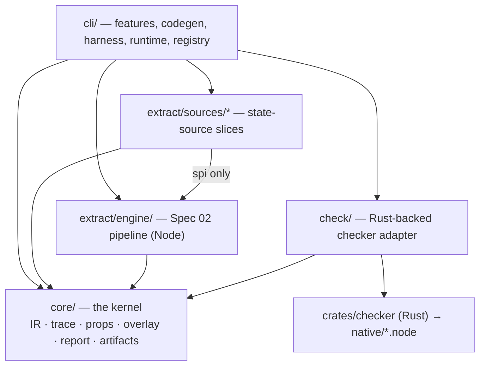

`modality-ts` is a single npm package whose internal structure is derived from three
forces:

1. **Two volatile axes, one stable core.** What changes: supported state libraries
   (axis 1) and user-facing capabilities (axis 2). What must *not* change casually: the
   IR, domains, trace format, and report schemas. So the design is **vertical slices
   along both axes, around a small schema-versioned kernel**.
2. **Three runtime contexts.** Extraction and checking run in Node; the replay harness
   runs in the app's test environment (jsdom); runtime assertions ship in the app's dev
   bundle. Module boundaries follow runtime contexts, not convenience — TypeScript
   extraction must never reach the browser, and app libraries like `jotai` must never
   burden the core.
3. **The plugin contract must be real.** The four built-in state sources use *exactly*
   the public plugin contract — they are its permanent conformance suite.

## Module map



Dependency rules are **enforced** in CI (dependency-cruiser, `pnpm architecture`), not
merely documented:

```text
core               → (nothing but TypeScript)
check              → core            (+ the native Rust addon)
extract/engine     → core
extract/sources/*  → core, extract/engine (SPI only); never each other; never cli
cli/harness        → core
cli/runtime        → core/props subpath only
cli/features        → everything above (features never import each other)
```

## The kernel: small by policy

`src/core/` publishes `modality-ts/core`. A thing enters the kernel only if ≥2 packages
in *different runtime contexts* need it and it has no dependencies of its own.

The flexibility boundary is stated honestly: **plugins contribute *instances* of IR
constructs, never new IR semantics.** A plugin can declare new state variables and emit
transitions in the existing closed IR, but it cannot add a new `EffectIR`/`ExprIR` node
kind — because the checker, exporter, and replay generator must understand every
construct they receive. A library whose semantics genuinely don't fit requires a kernel
RFC and a coordinated version bump. This is the price of keeping "verified" meaningful.

## Artifact-mediated coupling

Feature slices (`extract`, `check`, `replay`, `conform`, `export`, `ci`, `init`) never
import each other. They communicate only through schema-versioned `.modality/`
artifacts: `extract` writes `model.json`; `check` reads it and writes `traces/*.json`;
`replay` reads a trace. This is the same boundary the CLI user sees — so every feature
is independently scriptable and re-runnable, and a crashed `check` can re-run without
re-extracting.

## The pages in this section

| Page | Subsystem |
| --- | --- |
| [The IR](./ir.md) | the closed contract between all subsystems |
| [Extraction pipeline](./extraction-pipeline.md) | source → IR (P0–P7) |
| [The checker](./checker.md) | the native Rust explicit-state checker |
| [State sources & the plugin SPI](./state-sources.md) | how libraries plug in |
| [Navigation](./navigation.md) | the framework-agnostic routing adapter |
| [Conformance & replay](./conformance-and-replay.md) | closing the model–code gap |
