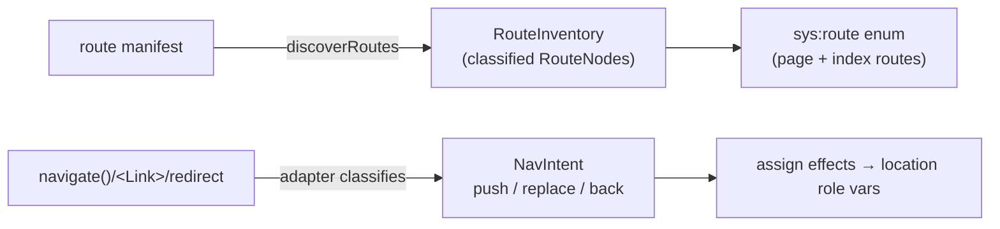

Routing is owned by a **framework-agnostic adapter**, not hardcoded into the extraction
engine. Exactly one router is active per app (unlike state sources, which compose), so
it is a sibling contract to the [state-source SPI](./state-sources.md): the
`RoutePlugin` (the react-router factory is `reactRouterAdapter()`).

## The model: nodes are routes, edges are intents

- **Nodes = the route manifest.** The route domain is driven by the manifest (a
  classified `RouteInventory`), not scavenged from literal `navigate()`/`<Link>` targets.
  This fixes the old failure where low-traffic routes that nothing navigated to *by
  literal* were simply missing from the location-current enum.
- **Edges = navigation intents** (`push` / `replace` / `back`), classified by the
  adapter from navigation calls and JSX.
- **Location vars** are adapter-owned ids (commonly `sys:route` / `sys:history`) stamped
  with `location-current` / `location-history` roles. A single navigation-lowering step
  produces ordinary `assign`/`if`/`seq` effects over them.
- **Optional route-tree vars** (`sys:next:slot:*`, `sys:next:phase:*`, …) extend
  mountedness for frameworks with layout trees, parallel routes, and intercepting
  routes. Adapters expose them through `routeTreeVars` and may lower navigation
  with `lowerNavigation` into `seq` effects that update both flat route state and
  slots. Properties that only care about the active URL pattern read the
  `location-current` role var — not a hard-coded `sys:route` id in trusted code.

## The engine is framework-blind

The extraction engine contains **zero** react-router-specific identifiers. It only ever
asks the adapter:

| Adapter method | Responsibility |
| --- | --- |
| `discoverRoutes` | parse the manifest into a `RouteInventory` |
| `classifyNavigationCall` | is this call a `push`/`replace`/`back`? to where? |
| `classifyNavigationJsx` | is this JSX element a navigation (e.g. `<Link>`)? |
| `routeForComponent` | which route does this component belong to? |
| `locationVars` | the location state variables |
| `routeTreeVars` | optional layout/slot/phase system vars (Next.js) |
| `lowerNavigation` | optional adapter-specific navigation lowering |
| `mountScopeForComponent` | optional mount boundary for local state |
| `harness` | replay navigation setup, observation, and `navigate` |

Module roles, effect APIs, cache/storage, and observation are **separate adapter
capabilities** registered alongside navigation — see
[state sources & SPI](./state-sources.md#adapter-capabilities-beyond-state-sources).

The same engine has been driven by a second, fake Next.js-style adapter in tests —
proving the abstraction is real and not react-router in disguise. Production Next.js
projects use the built-in `nextAdapter()` when `next` appears in `package.json`
dependencies (React Router remains the default otherwise).

## Built-in adapters

| Adapter | Activates when | Route model |
| --- | --- | --- |
| `reactRouterAdapter()` | `react-router` / `react-router-dom` in deps (or no deps in dev) | flat manifest (`app/routes.ts`) |
| `tanstackRouterAdapter()` | `@tanstack/react-router` in deps (after Next, before React Router) | file-based `routes/` / `src/routes/` plus optional `routeTree.gen.ts` and static code-based trees |
| `nextAdapter()` | `next` in deps (takes priority over React Router and TanStack Router) | App/Pages filesystem + optional route-tree vars |

## Route classification

`RouteKind` is `page | index | layout | resource`. **Modeled routes** (which enter the
`sys:route` enum) are `page` + `index`; `layout` and `resource` (e.g. API/`.ts` routes)
are excluded and listed with a reason in the **route-coverage report**. A redirect-only
page *is* modeled, with an automatic edge (below).

## Redirects lower to existing IR

A loader/route `redirect(T)` becomes an automatic route-bound `replace` transition —
a `seq` of ordinary assignments over the grouped location-current/history vars (and
optional route-tree vars). Event labels may still use `{ kind: "navigate", mode: "replace", to: T }`
for replay; there is **no** `navigate` effect kind in the trusted IR.

## History domain reduction (sound)

`sys:route` grows to all UI routes, but the `sys:history` **inner** domain is reduced to
the navigation-relevant subset (push origins ∪ push targets ∪ initial). When an
unbound/global push exists, it falls back to the **full** `sys:route` domain — a sound
over-approximation. If the reduced subset cannot be proven sound for a given app, the
adapter falls back to the full set rather than guessing a smaller one. `maxHistory`
defaults to 4.

## Default scope: client UI transitions

Default extraction models **client UI transitions** only. Server/full-route execution
(loaders, actions, initial data loading) is future work. Server-only modules are
excluded from the client model via the adapter's module-classification hints, so they do
not inflate it.

## TanStack Router module roles, effects, and cache

When `@tanstack/react-router` is active (and `next` is not), the built-in registry also
enables `tanstackRouterModuleRoleAdapter()`, `tanstackRouterEffectApiProvider()`, and
`tanstackRouterCacheStorageProvider()` alongside `tanstackRouterAdapter()`.

- **Module roles.** TanStack route modules are `shared` by default. Route option fields
  such as `loader`, `beforeLoad`, `validateSearch`, `head`, and `headers` are treated as
  server/data-loading surfaces; `component`, `pendingComponent`, `errorComponent`, and
  `notFoundComponent` identifiers remain client interaction roots. `.server.` and
  `/server/` paths are server-only.
- **Effect APIs.** Discovered loader/beforeLoad operations appear as `LOADER <route>` and
  `BEFORE_LOAD <route>` effect operations with source provenance. Loader/beforeLoad bodies
  are not symbolically executed.
- **Redirects.** Static `redirect({ to: "..." })` calls in loader/beforeLoad set
  `RouteNode.redirectTo`, which lowers to automatic route-bound `replace` transitions via
  the shared redirect synthesizer.
- **Loader cache.** Routes with loaders may emit bounded `sys:tanstack:loader-cache:*`
  vars (`empty | fresh | stale | refreshing | error`) plus stale/revalidate/error
  environment transitions. High loader counts are reduced with structured `model-slack`
  caveats rather than unbounded cache keys.
