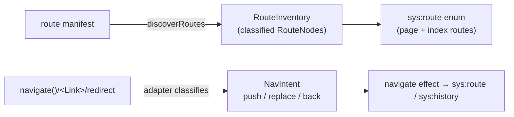

Routing is owned by a **framework-agnostic adapter**, not hardcoded into the extraction
engine. Exactly one router is active per app (unlike state sources, which compose), so
it is a sibling contract to the [state-source SPI](./state-sources.md): the
`NavigationAdapter` (the react-router factory is `reactRouterAdapter()`).

## The model: nodes are routes, edges are intents

- **Nodes = the route manifest.** The route domain is driven by the manifest (a
  classified `RouteInventory`), not scavenged from literal `navigate()`/`<Link>` targets.
  This fixes the old failure where low-traffic routes that nothing navigated to *by
  literal* were simply missing from `sys:route`.
- **Edges = navigation intents** (`push` / `replace` / `back`), classified by the
  adapter from navigation calls and JSX.
- **`sys:route` / `sys:history`** remain the fixed lowering target — the checker's
  location state. A single navigation-lowering step produces them; they are not
  hand-wired across the codebase.
- **Optional route-tree vars** (`sys:next:slot:*`, `sys:next:phase:*`, …) extend
  mountedness for frameworks with layout trees, parallel routes, and intercepting
  routes. Adapters expose them through `routeTreeVars` and may lower navigation
  with `lowerNavigation` into `seq` effects that update both flat route state and
  slots. `sys:route` stays the compatibility leaf-route enum for `route-local` scopes
  and properties that only care about the active URL pattern.

## The engine is framework-blind

The extraction engine contains **zero** react-router-specific identifiers. It only ever
asks the adapter:

| Adapter method | Responsibility |
| --- | --- |
| `discoverRoutes` | parse the manifest into a `RouteInventory` |
| `classifyNavigationCall` | is this call a `push`/`replace`/`back`? to where? |
| `classifyNavigationJsx` | is this JSX element a navigation (e.g. `<Link>`)? |
| `routeForFile` | which route does this module belong to? |
| `locationVars` | the location state variables |
| `routeTreeVars` | optional layout/slot/phase system vars (Next.js) |
| `lowerNavigation` | optional adapter-specific navigation lowering |
| `mountScopeForComponent` | optional mount boundary for local state |
| `classifyModule` / `moduleEntryExports` / `classifyImportEdge` / `isServerOnlyModule` | optional server/client module-boundary hints (used by P0) |

The same engine has been driven by a second, fake Next.js-style adapter in tests —
proving the abstraction is real and not react-router in disguise. Production Next.js
projects use the built-in `nextAdapter()` when `next` appears in `package.json`
dependencies (React Router remains the default otherwise).

## Built-in adapters

| Adapter | Activates when | Route model |
| --- | --- | --- |
| `reactRouterAdapter()` | `react-router` / `react-router-dom` in deps (or no deps in dev) | flat manifest (`app/routes.ts`) |
| `nextAdapter()` | `next` in deps (takes priority over React Router) | App/Pages filesystem + optional route-tree vars |

## Route classification

`RouteKind` is `page | index | layout | resource`. **Modeled routes** (which enter the
`sys:route` enum) are `page` + `index`; `layout` and `resource` (e.g. API/`.ts` routes)
are excluded and listed with a reason in the **route-coverage report**. A redirect-only
page *is* modeled, with an automatic edge (below).

## Redirects lower to existing IR

A loader/route `redirect(T)` becomes an automatic route-bound `replace` transition —
`{ kind: "navigate", mode: "replace", to: lit(T) }`. There is **no** new `EffectIR` or
label kind; redirects reuse the existing `navigate` effect, so the IR validator, the
checker, and the TLA+ export need no navigation-specific changes. (`forward`/`go` are
out of scope until the IR is extended.)

## History domain reduction (sound)

`sys:route` grows to all UI routes, but the `sys:history` **inner** domain is reduced to
the navigation-relevant subset (push origins ∪ push targets ∪ initial). When an
unbound/global push exists, it falls back to the **full** `sys:route` domain — a sound
over-approximation. If the reduced subset cannot be proven sound for a given app, the
adapter falls back to the full set rather than guessing a smaller one. `maxHistory`
defaults to 4.

## Default scope: client UI transitions

Default extraction models **client UI transitions** only. Server/full-route execution
(loaders, actions, initial data loading) is future work. Server-only modules are
excluded from the client model via the adapter's module-classification hints, so they do
not inflate it.
