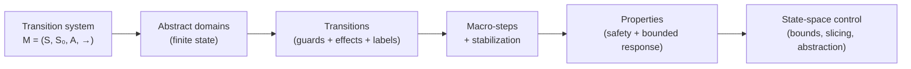

`modality-ts` rests on a small set of ideas borrowed from explicit-state model
checking and adapted to React. This section explains them in the order you need to
understand a verdict.

| Page | What it covers |
| --- | --- |
| [The transition system](./transition-system.md) | The formal object: states, initial states, actions, transition relation. |
| [State & abstract domains](./state-and-domains.md) | How React state becomes finite, including numeric domains and tokens. |
| [Transitions](./transitions.md) | Transition classes, guards, structured effects, and async splitting. |
| [Macro-steps & stabilization](./stabilization.md) | Run-to-completion semantics for `useEffect` reactions. |
| [Properties](./properties.md) | The closed combinator DSL and its normative semantics. |
| [State-space control](./state-space-control.md) | Bounds, cone-of-influence slicing, and abstraction — sound vs heuristic. |

A theme runs through all of them: **the model is finite by construction, and every way
the tool keeps it finite is either sound (the verdict still reads "verified within
bounds") or loudly labelled as heuristic.** Knowing which is which is the whole game.
