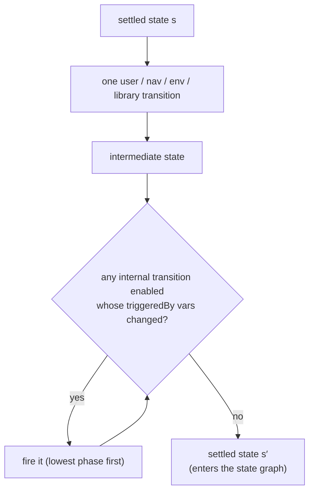

React runs effects *promptly* after a commit. If the model let `useEffect` reactions
interleave freely with user events, it would invent absurd schedules — a user "clicking
between" a state change and the guard redirect it triggers. `modality-ts` avoids this
with **run-to-completion macro-steps**, the standard construction from statecharts and
synchronous languages.

## What a macro-step is

An observable step is:

1. **One** `user` / `nav` / `env` / `library` transition, then
2. **stabilization** — repeatedly fire any enabled `internal` transition whose
   `triggeredBy` dependency vars changed since it last ran, until none is enabled.

Only **stabilized** states enter the reachable-state graph and are visible to
[properties](./properties.md). Verbose traces can still show the intermediate
micro-steps.

## Internal transitions are `useEffect` reactions

`useEffect` bodies that write modeled state become `internal` transitions with a
`triggeredBy` set (the dependency array). `useLayoutEffect` and `useInsertionEffect`
are modeled the same way. An auth-guard redirect —
`useEffect(() => { if (!user) navigate('/login') })` — is exactly an internal
transition, and stabilization is what makes "the redirect happens before the user can
do anything else" true in the model.

## Commit-phase ordering

Internal transitions carry a `phase` ordinal (a commit tier). When two enabled internal
transitions have **conflicting write sets**, the lower `phase` commits first — so layout
effects (`phase 0`) stabilize before passive effects (`phase 1`), matching React.

## When ordering is genuinely ambiguous

If two enabled internal transitions write **intersecting** variables and share the same
phase, the model **explores both orders** as nondeterminism — because React does not
promise an ordering across independent components, and the tool must not invent one.
This can surface real "effect-order-dependent" bugs.

## Divergence is a modeling error, not a verdict

Stabilization is capped at `maxInternalSteps` (default 16). Exceeding it means the
effect chain does not settle — i.e. an infinite re-render loop. This is reported as a
**modeling error** with the micro-step trace to the divergence point, *not* as a
property pass or fail. The trace is itself a useful artifact: it usually mirrors a real
runaway-`useEffect` bug.

## The accepted cost

Because only settled states are observable, properties **cannot** observe
mid-stabilization states. This is accepted — React batches commits similarly, so a
mid-stabilization state is not a state a user could ever observe either. The benefit is
a dramatically smaller, more faithful state space.
