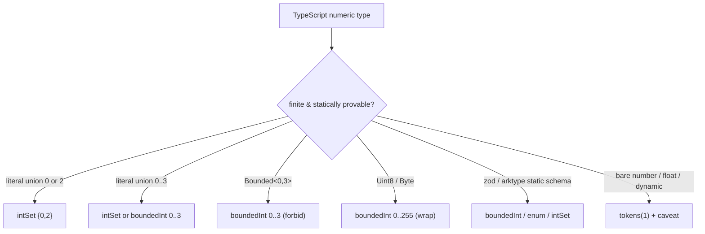

Every state variable has an **abstract domain**: a finite set of values it can take.
Domains are *data* (serializable), not code. Finiteness is what makes exhaustive
checking possible, and TypeScript types already do much of the work — a variable typed
`'idle' | 'loading' | 'error'` *is* a finite domain with no abstraction needed.

## The domain kinds

These are the `AbstractDomain` variants in the IR (`src/core/ir/types.ts`):

| Kind | Shape | Use |
| --- | --- | --- |
| `bool` | `true \| false` | booleans |
| `enum` | `values: string[]` | literal string unions, discriminant tags |
| `boundedInt` | `min, max` (+ `overflow`) | finite integer ranges (counters, widths) |
| `intSet` | `values: number[]` (+ `overflow`) | **sparse** finite integer sets (`0 \| 2`) |
| `option` | `inner` | `T \| null \| undefined` (null/undefined collapse) |
| `record` | `fields` | object types (with field pruning, below) |
| `tagged` | `tag`, `variants` | discriminated unions |
| `tokens` | `count`, `names?` | opaque values compared only by identity |
| `lengthCat` | — | collections abstracted to `'0' \| '1' \| 'many'` |
| `boundedList` | `inner`, `maxLen` | element-sensitive bounded lists |

### Tokens — the workhorse for server data

Properties rarely care *what* a server payload is — only whether it changed, is
present, or belongs to the wrong identity. `tokens` captures exactly that: opaque
values distinguished only by equality. Stale-cache bugs need ≥2 tokens (a `userA`
payload vs a `userB` payload). `count` is a bound; exhausting tokens during a search is
a **reported bound-hit**, never silent reuse.

### Length categories vs bounded lists

`lengthCat` (`0 / 1 / many`) is the default array abstraction — cheap and usually
enough. Element-sensitive reasoning (e.g. "the *i*-th item is expired") needs a
`boundedList`, which must be requested via an [overlay](../guides/refining-domains-and-overlays.md)
because it is the most expensive domain.

## Finite numeric domains

Unlike the original design, numbers can be **finite state** when their domain is
statically provable. This is type-driven, in the SPIN spirit — finite numerics are
concrete state values; bare `number` stays abstract.

- **Literal unions are exact.** `0 | 2` becomes `intSet {0,2}` — it does *not* widen to
  `0..2` and invent `1`. The domain fingerprint distinguishes the two.
- **Branded aliases** from `modality-ts/core` carry static ranges: `Bounded<Min,Max>`,
  `Wrapping<Min,Max>`, `Uint8`/`Byte` (`0..255`, wrap), `Uint16` (`0..65535`),
  `Short` (`-32768..32767`).
- **TypeScript semantic inference is primary** for structural domains (`record`, `enum`,
  `bool`, `tagged`, …). When a Zod or ArkType schema exports an inferred type
  (`z.infer<typeof S>`, `typeof S.infer`) that preserves finite literals, extraction
  maps those shapes without interpreting the schema runtime.
- **Type-library refinement providers** recover **refinements erased from TypeScript**,
  currently static integer bounds from `zod` (`.int()` with static two-sided bounds,
  inclusive/exclusive aliases, sign aliases, and finite `multipleOf`/`step`) and
  a narrow ArkType grammar on `type("…")` initializer strings: string literal unions
  (`enum`), inclusive integer ranges (`boundedInt`), and bounded `number.integer % n`
  intersections (`intSet` or `boundedInt`). String length, array length, and unbounded
  divisors are recognized but caveated. Providers live under
  `src/extract/plugins/type/` and are wired through the CLI registry — they are not
  part of the extraction engine's numeric module. Runtime-only predicates
  (`z.refine`, custom validators) are not interpreted unless represented in the
  inferred type or an adapter.
- **Overflow policy** (`forbid | wrap | saturate`) is part of the domain. Reachable
  overflow is a *model-checking behaviour*, not something erased by static validation —
  the checker evaluates it. See [Transitions](./transitions.md#numeric-effects).
- **Unprovable constraints abstain.** A wrong numeric bound would be unsound, so
  adapters fall back to `tokens(1)` and emit an extraction caveat rather than guess.

Wide numeric (or product) domains above a threshold raise a **cardinality warning**;
[numeric state reduction](../guides/refining-domains-and-overlays.md) is how you tame
them, with each reduction recorded with a soundness claim
(`exact` / `property-preserving` / `heuristic`) in the [trust ledger](../soundness/trust-ledger.md).

## Domain inference and field pruning

Extraction computes a domain `D(τ)` from the TypeScript type `τ` via `ts.TypeChecker`
semantic mapping (`src/extract/lang/ts/driver/type-domains.ts`), with AST fallback when the
checker is unavailable. Schema libraries contribute numeric refinements only where
TypeScript erases bounds; structural shapes come from inferred types. Two rules keep it
sound and small:

- **No `string` / unbounded `number` domain by accident.** Such types map to `tokens`
  (or an overlay-declared refinement), never to an enumerated set.
- **Field pruning (cone-of-relevance).** Record fields are kept only if something
  actually *reads* them (a guard, effect, derived value, or property). Unread fields
  collapse into the record's token identity. This is sound — unread fields cannot
  influence any modeled transition — and it is recomputed whenever properties change.

## Refinement: when `tokens` is too coarse

When a property needs to distinguish values a `tokens` domain hides (`cart.total > 0`,
`draft` non-empty), you declare a **predicate abstraction** in the overlay that replaces
`tokens` with an `enum` plus a *concretization obligation* (a witness per class, needed
for [replay](../architecture/conformance-and-replay.md)). See
[Refining domains & overlays](../guides/refining-domains-and-overlays.md).
