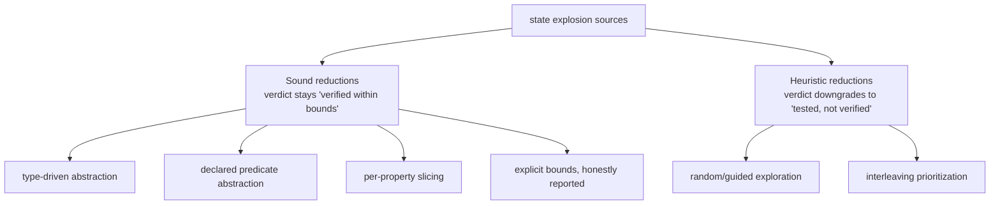

The model is finite by construction, but finite is not the same as *small*. The state
space explodes from, in order of severity: **data domains ≫ pending-request
interleavings > number of state variables > route history depth**. `modality-ts`
controls explosion with techniques split into two strictly separated buckets.

> The boundary between the buckets is the whole credibility of the tool. A sound
> reduction keeps "verified within bounds" meaningful; a heuristic one must visibly
> downgrade the claim.

## Sound reductions

These preserve the meaning of the verdict.

1. **Type-driven abstraction.** Finite union/literal types are used exactly — free and
   lossless. See [domains](./state-and-domains.md).
2. **Declared predicate abstraction.** For non-finite domains, you (or an extraction
   default) declare the distinctions that matter (`user: null | present`,
   `items.length: 0 | 1 | many`). Writes the abstraction cannot track precisely become
   `havoc` — an over-approximation, sound for safety. Any spurious counterexample it
   produces is caught by [conformance replay](../architecture/conformance-and-replay.md).
3. **Per-property cone-of-influence slicing.** Each property is checked against only the
   variables that transitively influence its predicates, using the IR's validated
   read/write sets. This is typically the single biggest scaling win — an auth-guard
   property does not pay for checkout-state interleavings, and vice versa. It is sound
   precisely because IR footprints are *over-approximations* validated at load time.
4. **Explicit bounds, honestly reported.** `≤ K` pending requests, `≤ H` history depth,
   `≤ N` trace depth, token counts. This is bounded verification in the small-scope
   tradition. The report says "verified for up to 2 concurrent requests" — never just
   "verified".

### State-space contributors

Every variable contributes `log₂(|domain|)` bits to the model's theoretical state
space. Extraction reports `stateContributors` with `totalBits`, ranked `topVars`, and
`bySource` provenance. Check reports echo per-slice economics in
`diagnostics.slicing.sliceSummaries`: `retainedBits`, `prunedBits`,
`topContributors`, and `prunedTopContributors`. Use these to see which domains dominate
before tightening bounds or refining overlays.

### Per-property slice economics

[Per-property slicing](#sound-reductions) drops variables and transitions outside the
property's cone of influence. Each slice summary records what survived and what was
pruned:

- `retainedBits` / `prunedBits` — bit budget kept vs dropped for this slice.
- `topContributors` / `prunedTopContributors` — ranked vars with domain kind, scope,
  origin, and optional `prunedFieldPaths`.
- `retainedSystemVars` / `prunedSystemVars` — adapter-owned vars (route, pending queue,
  cache entries) kept or dropped.

A property about local form state should show `sys:pending` and `sys:history` under
`prunedSystemVars` unless the property reads async step facts (`enqueued`, `resolved`,
`opId`, `opArgs`).

### Route, mount, and pending-queue pruning

Role-bearing system vars enter a slice only when a kept transition or property read
needs them:

- **Pending queue** (`role: pending-queue`) — retained when step predicates observe
  `enqueued`, `resolved`, `opId`, or `opArgs`; otherwise pruned. Slice summaries list
  `pendingQueueDependencies` with `reasons`, `opIds`, and `continuations` when retained.
- **Route / history** (`location-current`, `location-history`) — retained when the
  property or a kept transition reads them; mount-local vars retain only their guard
  dependencies (`mountScopeDependencies` explains `guardReads` and `retainedBecause`).
- **Mount-local state** — inactive at `⊥` when unmounted; slicing keeps mount guards
  (`sys:route`, slot predicates) only when the scoped var or a guard read is in the cone.

### Field-pruning metadata vs domain pruning

Record fields unread by any guard, effect, or property collapse into the record's
token identity during extraction. `model.metadata.fieldPruning` and
`extractionReport.fieldPruning` document which paths were kept vs pruned per var
(`reason`: `unread`, `property-unrelated`, or `bounded-record`). This is **metadata
about** pruning — the IR domain already reflects the pruned shape. Per-slice
`prunedFieldPaths` on contributors show field-level drops visible in check diagnostics.

### Numeric reductions

Wide finite numeric domains are tamed with explicit, **claim-tagged** reductions
(`exact` / `property-preserving` / `heuristic`) — deferred ranges, intervals, saturation,
predicate or input-class partitions. Each is recorded in the
[trust ledger](../soundness/trust-ledger.md) with its soundness claim, so a
`property-preserving` reduction reads differently from a `heuristic` one.

## Heuristic reductions

Randomized/guided exploration beyond bounds, interleaving prioritization, swarm-style
restarts. Useful as a fallback when a model is too big to exhaust — but the report must
visibly **downgrade its claim** to "tested, not verified."

## A bound hit is not a proof

When a [search limit](../guides/diagnostics-and-search-limits.md) (`--max-states`,
`--max-edges`, `--max-frontier`, `--memory-guard-mb`) stops a run, that is **not** a
verified result — it is an error verdict that says "I ran out of room." Treat it as a
prompt to slice the property, tighten the model, or raise the limit deliberately. The
diagnostics report the dominant variables (those with the most distinct observed
values) so you know what blew up.

### Manifest-owned state-space budgets

Inside the `modality-ts` repository, conformance fixtures and real-app canaries declare
state-space budgets in their manifests (`fixture.json` or `canaries.json`). Shared gate
helpers compare check and extraction reports against these caps:

| Budget field | Report source |
| --- | --- |
| `maxStates` | `checkReport.stats.states` |
| `maxEdges` | `checkReport.stats.edges` |
| `maxDepth` | `checkReport.stats.depth` |
| `maxFrontier` | `checkReport.diagnostics.search.maxFrontier` |
| `maxDominantVarValues` | `checkReport.diagnostics.dominantVars` |
| `maxStateSpaceBits` | `extractionReport.stateContributors.totalBits` |
| `maxTopContributorBits` | `extractionReport.stateContributors.topVars[0].bits` |
| `maxBoundHits` | `checkReport.trustLedger.boundHits` |

When any budget fails, runners classify the failure as `state-space-budget` and point
to the dominant contributors in the report. Active canaries without an explicit budget
must document `budgetNotApplicableReason` in the manifest.

Run `rtk pnpm ci:conformance` and `rtk pnpm ci:canaries` to exercise these gates in CI.

## Where AI is allowed — a bright line

`modality-ts` permits AI assistance only on the **additive** side:

- **Safe:** suggesting abstraction predicates, proposing candidate properties from code,
  drafting overlay annotations *that a human reviews*, explaining counterexamples.
- **Unsafe:** AI-pruned state spaces, AI-asserted transition semantics entering the model
  unreviewed, AI-judged "this counterexample is spurious, suppress it."

> AI may *add* behaviours, candidates, and explanations; it may **never** remove
> behaviours from the model or vouch for conformance. Any of the unsafe moves silently
> converts "verified" into "unsoundly verified."
