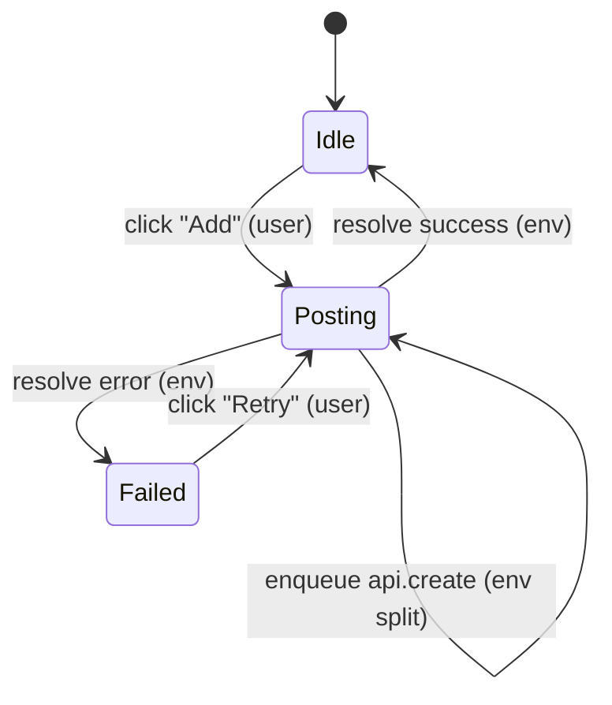

The model is a finite **labeled transition system (LTS)**:

```text
M = (S, S₀, A, →)
```

- `S` — the set of **states**. A state is a record mapping every state variable to a
  value in its finite [domain](./state-and-domains.md).
- `S₀ ⊆ S` — the **initial states** (more than one when an initial value is
  nondeterministic).
- `A` — the **actions** (labels): user clicks, navigations, environment resolutions,
  timers, etc.
- `→ ⊆ S × A × S` — the **transition relation**. `s —a→ s′` means action `a` is
  enabled in `s` and may produce successor `s′`. One action can have several successors
  (nondeterminism).



## The state vector

Each state is a record over the model's variables. Variables come from several
sources, and the ID prefix tells you which:

| Prefix | Source |
| --- | --- |
| `local:<Component>.<state>` | a `useState` in a component (route-scoped) |
| `atom:<name>` | a Jotai atom (`@store` qualifier when scoped) |
| `store:<name>.<field>` | a Zustand store field |
| `swr:<key>` | an SWR cache entry for a key class |
| `sys:route`, `sys:history` | adapter-owned location + bounded back-stack (`location-current` / `location-history` roles) |
| `sys:pending` | adapter-owned bounded multiset of in-flight async operations (`pending-queue` role) |
| `sys:timer:*`, `sys:suspense:*` | timer / Suspense state machines |

System variables are **optional** adapter-owned vars; when present they are stamped with
`role` metadata for validation and harness discovery. See [State & domains](./state-and-domains.md).

### Mount-local variables and `⊥`

A component's `useState` only exists while that component is mounted. The IR models
this directly: a mount-local variable is present in every state but holds the
distinguished value `⊥` (**unmounted**) when its mount predicate is false. Mounting
initializes it; unmounting resets it to `⊥`.

This makes "local state resets on remount" a **semantics of the model**, not a
convention each effect must remember — and because `⊥` canonicalizes identically
regardless of the pre-unmount value, the reset is automatic.

## Why finite, and why labeled

- **Finite** so the checker can explore *every* reachable state exhaustively. Finiteness
  is enforced by [abstract domains](./state-and-domains.md) and explicit
  [bounds](./state-space-control.md).
- **Labeled** so a path through the graph is a sequence of *user-meaningful events* —
  not opaque state edits. That label is what lets a counterexample be
  [replayed against the real app](../architecture/conformance-and-replay.md).

## Granularity: event-level, not render-level

`modality-ts` models at **event granularity**: each user event or async completion is
one atomic transition from a settled state to a settled state, with `useEffect`-driven
reactions folded in via [run-to-completion stabilization](./stabilization.md). It does
**not** model React's render internals (reconciliation, fiber bailouts, StrictMode
double-invoke) — those are invisible at this granularity by design.

This is the standard model-checking move: pick a granularity coarse enough to keep the
state space tractable, but fine enough to capture the bug class you care about — here,
**async interleaving races**.
