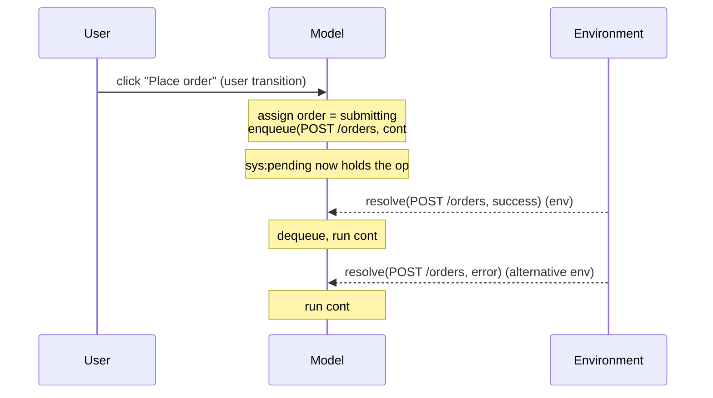

A transition is one atomic step of the model. Each carries a **guard** (when it is
enabled), an **effect** (how it changes state), a **class**, an **event label** (how to
replay it), and validated **read/write sets**.

```ts
interface Transition {
  id: string;
  cls: "user" | "nav" | "env" | "internal" | "library";
  label: EventLabel;
  guard: GuardIR;        // structured boolean expression — never opaque
  effect: EffectIR;      // structured, or an opaque overlay escape hatch
  reads: string[];       // MUST over-approximate the effect's footprint
  writes: string[];      //  (validated at load time)
  confidence: "exact" | "over-approx" | "manual";
  triggeredBy?: string[]; // for internal transitions: dependency vars
  phase?: number;         // commit tier; lower stabilizes first
}
```

## Transition classes

| Class | Meaning | Examples |
| --- | --- | --- |
| `user` | a user interaction | click, submit, input change |
| `nav` | route change / history | push, replace, back |
| `env` | external outcome (the environment acts) | async resolve, timer fire, focus revalidation |
| `internal` | a React reaction | `useEffect` body, derived reset, auth-guard redirect |
| `library` | behaviour supplied by a library template | SWR fetch lifecycle |

The checker explores **every enabled transition** from each reached state. The
interleaving of these classes — especially `env` resolutions against `user` events — is
where the bug class lives.

## Guards are always structured

A transition's guard is a structured boolean expression (`GuardIR = ExprIR`), never an
opaque function. This is a deliberate rule: an opaque guard would make *enabledness*
unanalyzable, which would break vacuity reporting, TLA+ export, the
[`enabled()`](./properties.md) property accessor, and partial-order reduction.

If extraction cannot express a condition structurally, the guard becomes `true` and the
condition moves *into* the effect as an `if` whose else-branch is identity — the
transition may fire as a harmless stutter. That is an over-approximation: sound, and
[reported](../soundness/trust-ledger.md).

## The structured effect language

Effects are built from a closed set of nodes (`EffectIR`), so the checker, exporter,
and replay generator all understand every effect they receive:

| Effect | Meaning |
| --- | --- |
| `assign(var, expr)` | set a variable to an expression's value |
| `havoc(var)` | set to **any** value in its domain (over-approximation) |
| `choose(var, among)` | bounded nondeterministic choice |
| `if(cond, then, else)` | conditional |
| `seq(effects)` | sequence |
| `enqueue(op, continuation, args)` | start an async operation (see below) |
| `dequeue(index)` | remove a resolved pending operation |
| `navigate(mode, to)` | push / replace / back |
| `opaque(ref)` | escape hatch: an overlay-supplied function with a declared footprint |

Expressions (`ExprIR`) are total and side-effect free: literals, variable reads,
boolean/equality operators, `cond`, field updates (`{...x, f: v}`), tag checks,
`lenCat`, `freshToken`, the enabledness accessor, and the snapshot reads `readPre` /
`readOpArg` (below). `havoc` and `choose` are how the extractor stays
[sound](../soundness/e1-invariant.md) when it cannot represent a write precisely.

### Numeric effects

Numeric domains bring ordered comparisons (`lt`, `lte`, `gt`, `gte`) and integer
arithmetic (`add`, `sub`, `mod`) into `ExprIR`. Assignment applies the domain's
**overflow policy**: `forbid` (out-of-range is a modeling error), `wrap` (modular), or
`saturate` (clamp). Crucially, reachable overflow is explored as a *behaviour*, not
erased — a counter that can wrap to `0` and re-enable a guard is a real bug the checker
will find.

## Async split-transitions

The signature React-race machinery. A handler containing `await someEffectApi(...)` is
**split** at the await boundary:



- The synchronous prefix becomes the **user transition** plus an `enqueue`.
- Each post-`await` segment becomes a **continuation**, indexed by the operation's
  outcome domain (success payload = `D(return type)`; error defaults to a single
  `error` value, refinable via an overlay).
- A separate **`env` resolve transition** later dequeues the operation and runs the
  matching continuation.

Because resolutions are ordinary transitions, the checker explores **all orderings** of
outstanding operations against each other and against user events. Double-submit and
response-reordering races emerge with no further extraction cleverness. The concurrency
**bound** `K` (max pending operations) limits this; hitting it is reported.

### Snapshot reads: batching and stale closures

Two `ExprIR` reads model React's timing faithfully:

- `readPre(var)` — reads the **macro-step pre-state** snapshot. React-18 auto-batching
  means direct closure reads in a handler see the render snapshot, while functional
  updaters `setX(p => …)` chain through the accumulator. `readPre` is how the model
  avoids over-counting batched updates.
- `readOpArg(key)` — reads a value **snapshotted at enqueue time** into the pending
  operation's args. This models the **stale closure**: a continuation that ran after an
  `await` sees the values captured when the request started, not current state.

## The opaque escape hatch

When extraction genuinely cannot summarize a handler, an [overlay](../guides/refining-domains-and-overlays.md)
can supply an `opaque` effect: a real function `(s) => s' | s'[]` with **declared**
reads and writes. The checker runs it directly; in debug mode it validates that the
function only writes its declared variables (an undeclared write is a hard modeling
error). For TLA+ export, opaque effects become `havoc(declaredWrites)` — a stated
over-approximation. This split — full analyzability for what extraction handles, full
expressiveness for what humans write — is the load-bearing compromise of the IR.
