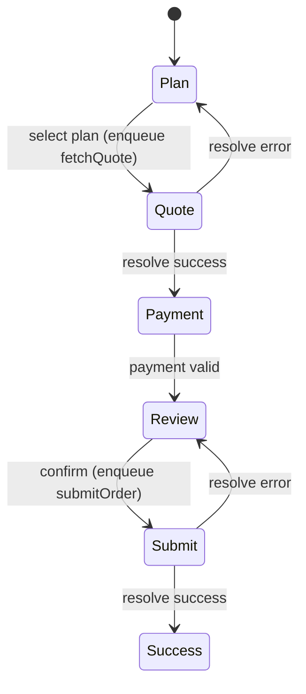

The checkout example models a multi-step flow: auth → plan selection → quote loading →
payment setup → review → submit → success. It is the stress test for relational data,
multi-parameter cache keys, op-argument snapshots, and conditional reachability.



## Properties it checks

- **guests cannot advance** into billing or review (route/step guards as `always`);
- **submit is possible only** for an authenticated user with a selected plan
  (an [`enabled`](../guides/writing-properties.md#pattern-enabledness-enabled) check);
- the success step is reached **only after** a successful submit;
- an async **quote failure does not validate a stale plan** — a snapshot-staleness rule
  comparing the resolving op's `args` against current state;
- from any state with a valid payment method, **review remains reachable**
  ([`reachableFrom`](../guides/writing-properties.md#pattern-conditional-reachability-reachablefrom)).

## Modeling features it exercises

- **Multi-parameter SWR keys** (`['quote', uid, plan, seats, cycle, coupon]`) handled via
  the [bounded key window](../sources/swr.md#multi-parameter-keys-and-the-key-window)
  rather than the full parameter product;
- **op-argument snapshots** so "an order success whose `args.userId` differs from the
  current user must not advance" is expressible without temporal operators;
- **conditional reachability** for the "review stays reachable" family;
- **finite numeric** fields (e.g. `seats`) from typed input via the
  [numeric domains](../sources/react-features.md#finite-numeric-domains).

## Run it

```bash
npx modality extract examples/checkout-app/App.tsx \
  --effect-api api.fetchQuote \
  --effect-api api.submitOrder
npx modality check .modality/model.json examples/checkout-app/app.props.mjs
```

This is the example that drove several DSL additions: relational list data,
multi-parameter cache keys, op-argument snapshots, and the
[`reachableFrom`](../concepts/properties.md) combinator.
