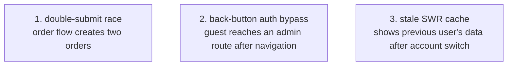

The demo fixture **intentionally contains modeled bugs**. It is the living acceptance
test: extracting and checking it must keep finding the seeded failures, so a regression in
extraction or checking is caught immediately.

## The seeded bugs



| Bug | Bug class | Property that catches it |
| --- | --- | --- |
| Double submit | response race | `sys:pending[POST /orders] ≤ 1` (or `alwaysStep` on repeated enqueue) |
| Back-button auth bypass | navigation interleaving | `always`: on an admin route, session must be authenticated |
| Stale cache after account switch | cache identity | snapshot/identity rule: cache token must match the current user token |

Each is an **interleaving** bug — the kind a single Playwright path will not reliably
hit, but exhaustive [BFS](../architecture/checker.md) finds with a shortest trace.

## Run it

```bash
npx modality extract examples/demo-app/App.tsx --effect-api api.placeOrder
npx modality check .modality/model.json examples/demo-app/app.props.mjs
```

Each violation produces a shortest counterexample trace; replaying it against the demo
app should return [`reproduced`](../guides/debugging-counterexamples.md) — proving the
[conformance machinery](../architecture/conformance-and-replay.md) works end to end.

## Why a deliberately-buggy fixture matters

It exercises the *whole* stack in one place — extraction, the IR, the checker, trace
construction, and replay — so a dependency-rule breach or a contract regression that unit
tests miss surfaces here. It is also the original proof-of-concept target: find three
seeded interleaving bugs that the app's example-based tests miss, each with a shortest
trace, fast.
