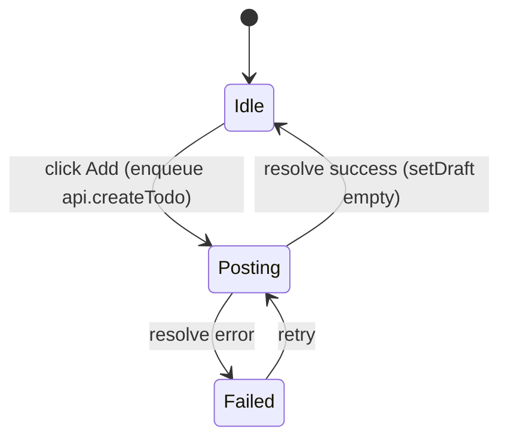

The todo example combines four sources: local `useState`, a [Jotai](../sources/jotai.md)
auth atom, an [SWR](../sources/swr.md) query, and an async create operation.

```tsx
export const authAtom = atom<"guest" | "user">("guest");

export function App() {
  const setAuth = useSetAtom(authAtom);
  const [draft, setDraft] = useState<"empty" | "nonEmpty">("empty");
  const [saveStatus, setSaveStatus] = useState<"idle" | "posting" | "failed">("idle");
  const { data } = useSWR<TodosData>("/api/todos", api.fetchTodos);

  return (
    <button
      type="button"
      disabled={saveStatus === "posting"}
      onClick={async () => {
        setSaveStatus("posting");
        await api.createTodo();
        setDraft("empty");
        setSaveStatus("idle");
      }}
    >
      Add
    </button>
  );
}
```

## What the model captures



- the `disabled={saveStatus === "posting"}` attribute becomes a
  [guard conjunct](../architecture/extraction-pipeline.md#p3--handler-discovery), so the
  model knows the button cannot be clicked again while posting;
- `await api.createTodo()` is [split](../concepts/transitions.md#async-split-transitions)
  into an enqueue + a continuation that resets the draft;
- the SWR query is a [template instance](../sources/swr.md) keyed by `/api/todos`.

## Properties it checks

- a create request should **not** be enqueued for a guest (an
  [`alwaysStep`](../concepts/properties.md) on `stepEnqueued("api.createTodo")` with
  `pre: auth === guest`);
- empty drafts should not be submitted;
- a stale completion should not reset the current draft (a snapshot-staleness rule using
  the op's `args`);
- there should not be more than one pending create operation (a `sys:pending` bound on
  the op).

## Run it

```bash
npx modality extract examples/todo-app/App.tsx --effect-api api.createTodo
npx modality check .modality/model.json examples/todo-app/app.props.ts
```

This example is where step invariants and the `enabled` accessor earn their keep — the
"guest cannot submit" rule is *reachably wrong* as a state invariant (logout while a
create is in flight legally yields `guest ∧ pending`), so it must be written as an
[`alwaysStep`](../guides/writing-properties.md#pattern-action-invariant-alwaysstep).
