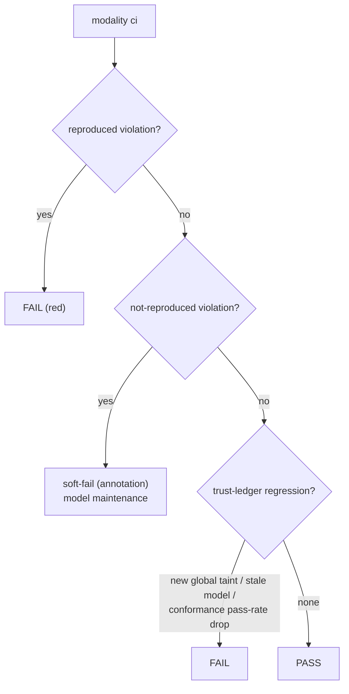

Bounded checks are deterministic and fast (seconds to minutes at typical scale), which
makes them a normal CI gate. The `ci` command bundles the workflow and writes all
artifacts into one directory.

## The `ci` command

```bash
npx modality ci .modality/model.json app.props.mjs --artifacts .modality
```

You can also let CI derive the model path from a discovered property file:

```bash
npx modality ci app.props.mjs --artifacts .modality
```

It writes the model, the [trust ledger](../soundness/trust-ledger.md) report, violation
traces, and conformance artifacts under `--artifacts`. `ci` is an *orchestration* slice:
it may call the `check` and `conform` command wrappers, but it still communicates through
artifacts.

## What to gate on



The recommended failure policy:

- **Reproduced violation → red.** A real app bug.
- **Not-reproduced violation → soft-fail by default.** It is a model-maintenance task;
  making it red trains teams to delete properties. Harden this to red once your model
  stabilizes.
- **Trust-ledger regression → fail.** Because caveats are
  [typed and severity-tagged](../soundness/e1-invariant.md), CI can gate on *changes*:
  - a new `global-taint` / `unsound-risk` caveat (the model just got weaker),
  - a drop in per-transition conformance pass-rate (the model drifted from the app),
  - a **stale model hash** (code changed under an unregenerated model).

This turns the ledger into a ratchet — model honesty can only improve, or the build
breaks.

## Useful `ci` options

| Option | Purpose |
| --- | --- |
| `--baseline <path>` | compare against a previous report to detect regressions |
| `--source <path>` | the source root for staleness/drift detection |
| `--conform-count <n>` / `--conform-depth <n>` | size the proactive conformance walks |
| `--min-conform-pass-rate <r>` | fail if overall conformance drops below `r` |
| `--min-transition-conform-pass-rate <r>` | fail if any single transition drops below `r` |

## Keeping the model fresh

Run `modality extract` as part of CI (or check the committed model's source hash) so a
code change under an unregenerated model fails the build. The model file is
canonically-ordered JSON, so its diff is reviewable in the pull request — the diff *is*
the "did this refactor change behaviour?" review.

## Semantics-sensitive changes

If you are changing extraction, checker, or export semantics inside the `modality-ts`
repository itself, also run the differential suite that validates the checker against TLC:

```bash
pnpm phase7
```

See [Checker correctness](../soundness/checker-correctness.md) and
[Exporting to TLA+](./exporting-to-tla.md).
