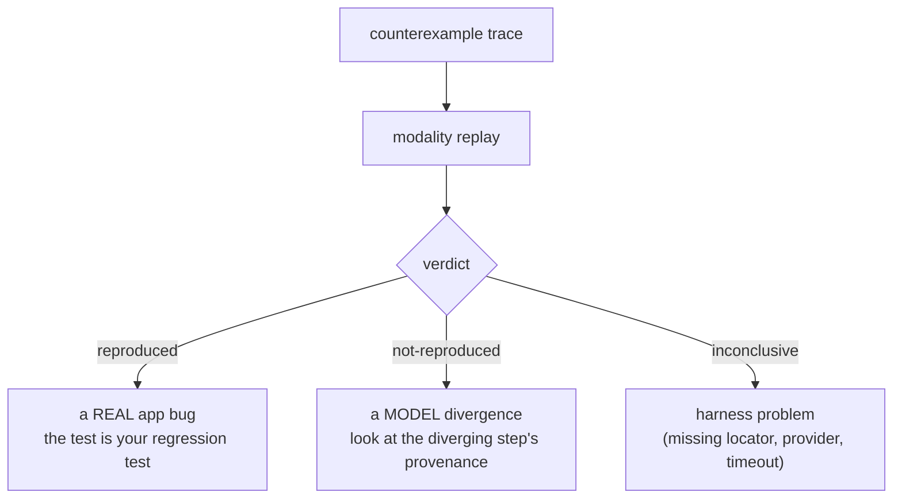

When a property is `violated`, the checker writes a **shortest** counterexample trace
(BFS guarantees minimal length). This guide is about turning that trace into a fix.

## Anatomy of a counterexample

A trace is a sequence of steps, each with the transition ID, the
[event label](../architecture/ir.md#event-labels-the-replay-contract), the pre/post
state, and the focused diff. The terminal rendering foregrounds the variables in the
violated predicate's read set:

```text
✗ noDoubleSubmit violated (4 steps)
  1. navigate /checkout            sys:route: /home → /checkout
  2. click "Place order"           sys:pending[POST /orders]: 0 → 1   (CheckoutPage.tsx:41)
  3. click "Place order"           sys:pending[POST /orders]: 1 → 2   ← violates noDoubleSubmit
     hint: submit handler has no guard on order.kind === "submitting"
  Property: app.props.mjs   |   Bounds: ≤2 pending, depth ≤12   |   Abstractions: 3 (listed)
```

The **hint** line is heuristic and clearly labelled — pattern rules over the trace (e.g.
"same user transition fired twice while `pending` is non-empty and no guard reads a
submitting-like var" → double-submit). Hints never affect verdicts.

## Replay decides whether it is real



```bash
npx modality replay .modality/traces/noDoubleSubmit.violated.trace.json
```

- **reproduced** — the real app exhibits the violation. Fix the app; keep the generated
  test as a regression test.
- **not-reproduced** — the app does *not* violate it. This is a **model** problem, not an
  app problem. Check the diverging step's extraction provenance: divergence at an `exact`
  transition is an extraction defect (high priority); divergence at an `over-approx` or
  `manual` transition is expected slack — [refine the overlay](./refining-domains-and-overlays.md)
  if it recurs.
- **inconclusive** — infrastructure (a missing locator, a provider setup error, a
  timeout). Fix the harness; it counts as neither verdict.

## Abstract vs action replay

```bash
# abstract: drive the model harness through the same steps
npx modality replay <trace.json> --mode abstract

# action: drive real DOM interactions through a harness module
npx modality replay <trace.json> --mode action --harness test/replay-harness.ts
```

A trace through a transition with no resolvable locator is marked non-replayable; its
counterexample stays an abstract trace, and the report names the blocking labels.

## Reading the diff and the read set

The renderer marks the variables in the violated predicate's read set, so the relevant
state change is foregrounded. If the diff that triggers the violation is on a variable you
did not expect, that is often a sign of an [over-approximation](../soundness/e1-invariant.md)
(a `havoc` took a branch the code cannot) — confirm with replay before assuming an app
bug.

## `leadsToWithin` and `reachableFrom` traces

- A `leadsToWithin` counterexample is the main-search path to the trigger plus the
  failing suffix that exhausts the budget without reaching the goal. If the convergence is
  real but just slow, raise the `budget`.
- A `reachableFrom` counterexample is **non-replayable** by nature (it asserts a path does
  *not* exist): the report shows the trace to the witness `when`-state plus an
  exhausted-search certificate and a nearest-miss hint.

## Determinism helps

Because the checker is [deterministic](../architecture/checker.md#determinism), the same
model and properties always produce the *same* counterexample. A trace you debug today is
the trace your colleague sees tomorrow — and the one CI will keep producing until the bug
is fixed.
