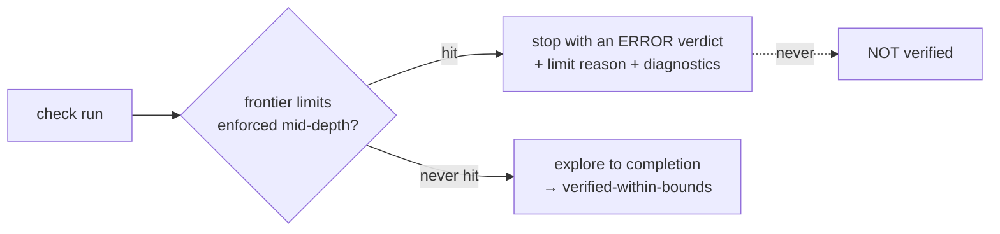

Real apps can produce large state spaces. `modality-ts` protects everyday checks with
**search limits** and explains where the space went with **diagnostics**. This guide is
about using both.

## Default limits

`modality check` applies conservative limits by default. Override them as needed:

| Flag | Stops when… |
| --- | --- |
| `--max-states <n>` | the number of distinct states reaches `n` |
| `--max-edges <n>` | the number of explored edges reaches `n` |
| `--max-frontier <n>` | a single BFS frontier reaches `n` states |
| `--memory-guard-mb <n>` | estimated memory crosses `n` MB |
| `--no-search-limits` | disables all of the above (intentional local runs) |

```bash
npx modality check --max-states 50000 --max-edges 150000
npx modality check --no-search-limits   # unbounded; for local exploration only
```

## A limit hit is an error, not a pass



When a limit stops a run, the property's verdict is `error` with a `limits.reason`, never
`verified-within-bounds`. The limits are enforced **mid-depth** (not only at layer
boundaries), so a single explosive frontier cannot OOM the process before the guard
trips. Treat a limit hit as a prompt to [slice or tighten](../concepts/state-space-control.md),
not as a result.

## Reading the diagnostics

The `report.json` carries an optional `diagnostics` block (and the terminal prints
compact summaries):

- **slicing** — whether slicing was enabled, how many slices, per-slice var/transition/
  state/edge/depth counts, and the skip reason when slicing was unavailable for a
  property (e.g. untargeted or positive `alwaysStep` and `leadsToWithin` use full-model
  search). Negated targeted `alwaysStep` slices report `mode: "targetedStep"` in
  `sliceSummaries`. Each summary may also include:
  - `retainedBits` / `prunedBits` — theoretical bit budget kept vs dropped.
  - `topContributors` / `prunedTopContributors` — ranked state-space contributors
    (`varId`, `domainKind`, `bits`, `scope`, `origin`, optional `prunedFieldPaths`).
  - `retainedSystemVars` / `prunedSystemVars` — adapter-owned vars kept or pruned.
  - `pendingQueueDependencies` — when a pending-queue var is retained, with `reasons`,
    `opIds`, and `continuations`.
  - `mountScopeDependencies` — mount-local vars with `guardReads` and `retainedBecause`.
- **search** — max and final frontier size, expanded depths, elapsed time.
- **limits** — the reason a run stopped early and which limit bound (`maxStates`,
  `maxEdges`, `maxFrontier`, `memoryGuardBytes`). A limit hit produces an `error` verdict
  and may downgrade property `confidence.level` to `bounded`.
- **dominantVars** — the variables with the most distinct observed values. This is your
  first clue to *what* exploded: a `dominantVars` entry with a huge distinct-value count
  is a domain to [refine or reduce](./refining-domains-and-overlays.md).

### Property confidence

Each verdict may carry `confidence` when the property slice retains non-exact
transitions, model-slack caveats, numeric reductions, bound hits, or search limits:

| Level | Typical cause |
| --- | --- |
| `exact` | no downgrade factors in the slice |
| `property-preserving` | numeric reduction tagged property-preserving |
| `over-approx` | over-approx/manual transitions or model-slack caveats in slice |
| `manual` | manual transitions in slice |
| `bounded` | configured bound or search limit bit during this run |
| `heuristic` | heuristic numeric reduction |

Terminal output prints a compact line when confidence is not exact, for example
`confidence=over-approx reasons:2`. The full `reasons`, `caveatIds`,
`affectedTransitions`, and `affectedVars` arrays are in `report.json`.

### Bound hits vs configured bounds

`model.bounds` (`maxDepth`, `maxPending`, `maxInternalSteps`) defines what the model
*assumes*. `trustLedger.boundHits` lists bounds that **actually bit** during the run
(for example `maxPending reached` or token exhaustion). A configured bound that never
binds does not appear in `boundHits` — it added no caveat. Distinguish these from
CLI search limits in `diagnostics.limits`, which stop exploration early and yield
`error` verdicts.

## A worked tightening loop

1. Run `modality check`; a property errors with a `max-states` limit.
2. Look at `diagnostics.dominantVars` — say `swr:GET /api/items` has 400 distinct values.
3. That cache payload is a `lengthCat`/`tokens` blow-up or a wide numeric domain. Refine
   it to the distinctions the property actually needs (e.g. `empty | nonEmpty`).
4. Confirm via `diagnostics.slicing` that the property's slice dropped the irrelevant
   variables.
5. Re-run; the state count collapses and the verdict becomes
   `verified-within-bounds`.

## Slicing is automatic but observable

[Per-property slicing](../concepts/state-space-control.md) is on by default and is the
biggest single lever — an auth-guard property should not pay for checkout interleavings.
The diagnostics show, per slice, how many vars and transitions survived, so you can see
slicing working (or see why it was skipped). Untargeted `alwaysStep` and `leadsToWithin`
properties use full-model search by design, so they will report a slicing skip reason or
`mode: "full"`. Focused negated `alwaysStep` properties with `stepTransitionId(...)`
report `mode: "targetedStep"` and smaller transition counts.

## Contributors report

The diagnostics' dominant-variable ranking is effectively a **state-space contributors**
report: it ranks which variables (and the transitions writing them) are driving the
size. Use it to decide where a [bound](../soundness/trust-ledger.md), a domain
refinement, or a numeric reduction will buy the most.
