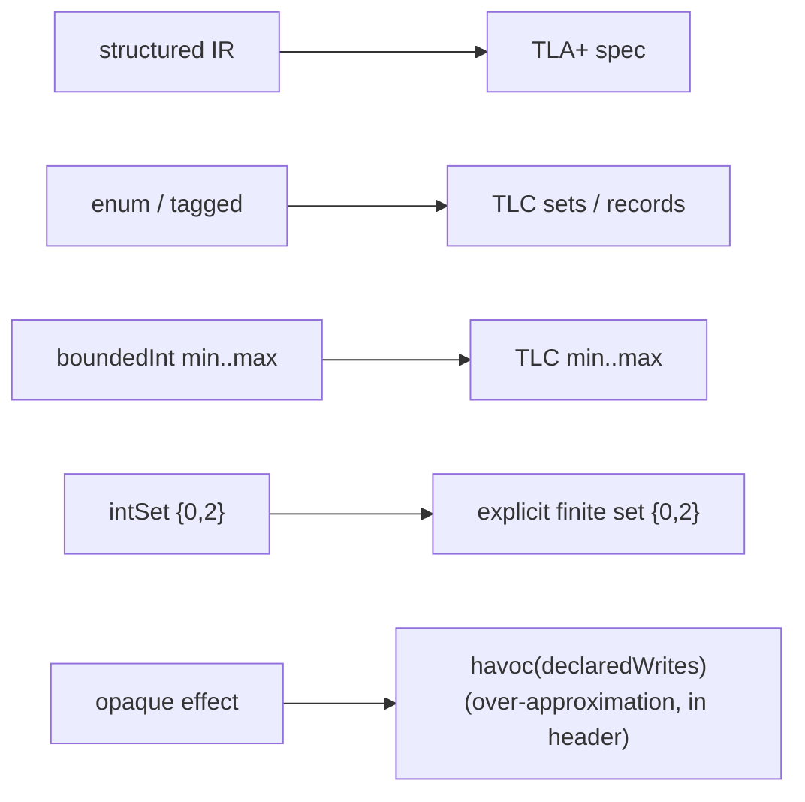

The IR is serializable and mechanically translatable to TLA+, which serves two purposes:
**differential validation** of the checker against TLC, and a **scale path** for models
that exceed explicit-state reach.

## Exporting

```bash
npx modality export .modality/model.json --format tla --out .modality/model.tla
```

The export uses only the **structured IR** (enums, bounded/finite ints, structured
effects and guards) — not arbitrary functions — so the translation is mechanical.

## What translates how



- **Finite numeric domains:** wide `boundedInt` exports as a TLC range `min..max`;
  sparse `intSet` exports as an explicit finite set, so `0 | 2` stays `{0, 2}` and never
  silently gains `1`.
- **Opaque effects** become `havoc(declaredWrites)`. A model containing opaque effects
  therefore exports as a *stated over-approximation* of itself — the export header says
  so. This is why differential testing uses **structured-only** models.

## Differential validation

This is the primary mitigation for "what if the custom checker is wrong?" A corpus of
structured-only models is exported and run through TLC, asserting identical
reachable-state counts, identical invariant verdicts, and cross-validated
counterexamples. In the `modality-ts` repository this is driven by:

```bash
pnpm phase7
```

See [Checker correctness](../soundness/checker-correctness.md) for the full assurance
strategy (differential, metamorphic, oracle, and canonicalization tests).

## When to reach for export

- You want an **independent** check of a critical model (belt and suspenders).
- A model has outgrown the explicit-state envelope and you want TLC's symbolic-adjacent
  scale or fairness machinery.
- You are contributing to the tool and need to extend the differential corpus.

For everyday checking, the [native checker](../architecture/checker.md) is the path;
export is the escape hatch and the validation harness, not the default workflow.
