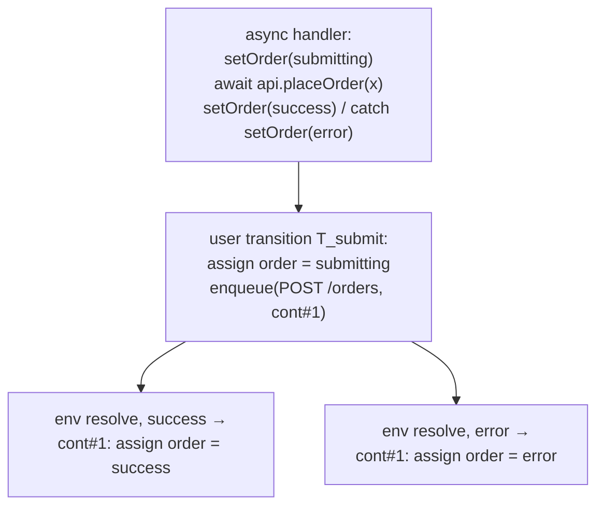

The async-race bugs `modality-ts` is best at — double submit, out-of-order responses,
stale-resolve-after-logout — only appear in the model if the relevant network calls are
modeled as **effect operations**. This guide is about getting them in.

## Naming effect APIs

The extractor needs to know which function calls are *network operations* so it can
[split handlers at `await` boundaries](../concepts/transitions.md#async-split-transitions).
Name them with `--effect-api` (repeat per function):

```bash
npx modality extract src/App.tsx \
  --effect-api api.placeOrder \
  --effect-api api.fetchQuote
```

`fetch` and configured effect-API wrappers are also recognized from the interaction
surface. Each discovered operation is recorded with its provenance in the
[extraction report](../soundness/trust-ledger.md).

## What the split produces



- the synchronous prefix → a **user** transition + `enqueue`;
- each post-`await` segment → a **continuation** indexed by the op's outcome domain;
- a separate **`env` resolve** transition runs the matching continuation later, in any
  order relative to other pending ops and user events.

## Outcome domains

- **Success payload** = `D(return type)` of the effect API. A fetcher returning `Todo[]`
  yields a `lengthCat` payload, so properties can distinguish loaded-empty from
  loaded-some.
- **Error** defaults to a single `error` value, because TypeScript does not type thrown
  values. Refine it via `overlay.outcomes(op, {...})` when continuations or properties
  need to distinguish failure classes (unauthorized vs server).

Sequential awaits chain (`cont_i` ends with `enqueue(op_{i+1}, cont_{i+1})`).
`Promise.all` of effect APIs enqueues all, with the continuation guarded on all resolved.
Racing patterns beyond that are `unextractable`.

## Unhandled rejections are reported

If an `await` has no enclosing `try/catch`, the error outcome runs no continuation — an
**unhandled rejection**, which is usually itself a bug. It is surfaced as a typed caveat
in the trust ledger, not silently ignored.

## The concurrency bound

The number of simultaneously pending operations is bounded by `K` (`maxPending`). This is
what makes the interleaving space finite. Hitting the bound is a **bound-hit event** in
the trust ledger — if your double-submit property needs to see 2 pending creates, make
sure `K ≥ 2`.

## Stale reads across `await`

A continuation reads **current** model state by default, which matches React for the
synchronous prefix but diverges after an `await` (real code sees the captured closure).
Where this matters, the read-set is snapshotted into the operation's args at enqueue and
read via `readOpArg` — so the continuation sees the value as of enqueue time. Vars at
risk are flagged as `stale-read` caveats; properties touching them report
`over-approx`, and [conformance replay](../architecture/conformance-and-replay.md) is the
arbiter. See [React features](../sources/react-features.md#stale-closures).

## Callback-style mutations

Some libraries (TanStack Query's `mutate`, plain mutation helpers, React Hook Form
handlers) call effect APIs **without `await`**, passing outcome handlers in a callbacks
object:

```ts
approveRequest(
  { id, slug },
  { onError: () => setApprovalState("indeterminate") },
);
```

The extractor recognizes this pattern when the callee matches a configured effect API and
the second argument is an object literal with `onSuccess` / `onError` properties. It
produces the same three-transition lifecycle as `await`-based async:

| Transition | Class | Content |
| --- | --- | --- |
| `<comp>.<attr>.<op>.start` | `user` | state writes before the call + `enqueue(op)` |
| `<comp>.<attr>.<op>.success` | `env` | runs `onSuccess` body (if present), dequeues |
| `<comp>.<attr>.<op>.error` | `env` | runs `onError` body (if present), dequeues |

Both `onSuccess` and `onError` may be concise arrow bodies (`() => setState(v)`) or
full blocks. If only one callback is present, only the corresponding resolve transition
is emitted.

## Timers and revalidation as environment events

`setTimeout`/`setInterval` become a [`sys:timer:*` state machine](../sources/react-features.md#timers)
whose firing is a guarded `env` transition; SWR focus/interval revalidation is a
nondeterministically enabled `env` event. Both interleave with everything else, which is
exactly how real-world "the timer fired mid-submit" surprises get caught.

## WebSocket streams and message variants

`new WebSocket(...)` inside a React effect becomes a [`sys:websocket:*` state
machine](../sources/react-features.md#timers) whose lifecycle and configured message
variants are guarded `env` transitions. Registration assigns `connecting`; `onopen` /
`onclose` / `onerror` advance the socket state and summarize callback writes; cleanup
`ws.close()` remains an `internal` transition. Message payloads are not inferred from
`JSON.parse(event.data)` — declare variants in config (`environment.webSockets[].messages`)
with abstract `bind` fields so `switch (message.type)` branches can be summarized per
variant.
