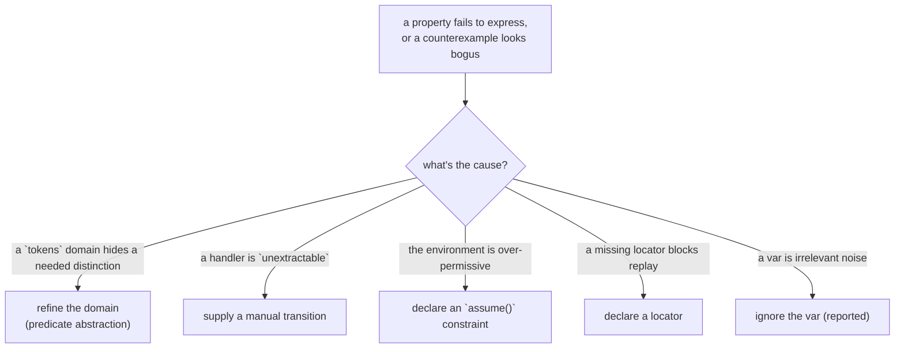

Extraction's defaults are deliberately coarse and safe: unknown values become
[`tokens`](../concepts/state-and-domains.md), unsummarizable handlers become
`unextractable`. The **overlay** is where you sharpen the model — manually, reviewably,
and *additively* (regeneration never clobbers it).

## When you need an overlay



## Refining a coarse domain

A `tokens` domain cannot express `cart.total > 0` or "draft is non-empty". Declare a
**predicate abstraction** that replaces `tokens` with an `enum` plus a *witness per
class* (the witness is required — an unconcretizable refinement is rejected at extract
time, so [replay](../architecture/conformance-and-replay.md) always has concrete values):

```ts
overlay(M)
  .refineDomain("atom:cartTotal", enumOf("zero", "positive"), {
    witness: { zero: () => 0, positive: () => 42 },
  });
```

Two things then happen automatically:

- **Writes** to the refined var are mapped through the predicates when the written
  expression is decidable, else `havoc`'d over the refined enum (still sound).
- **Reads** through concrete expressions are *predicate-matched*: a guard like
  `draft.trim().length > 0` that α-matches the refinement's predicate is rewritten to the
  abstract test (`draft === "nonEmpty"`). A read that matches *no* predicate makes the
  enclosing condition nondeterministic and is **reported per occurrence**, so a missing
  match becomes a spurious counterexample that *names* the unmatched expression — your cue
  to extend the refinement.

Payload fields of async outcomes refine the same way (`refinePayload(op, field, ...)`),
since `Quote.total: number` otherwise defaults to `tokens(1)`.

## Taming finite numeric state

Wide finite numeric domains explode the state space. Reduce them with explicit,
claim-tagged reductions recorded in the [trust ledger](../soundness/trust-ledger.md):

- prefer **exact** type-driven domains where possible (a literal union `0 | 2` is already
  exact `intSet`);
- use the branded aliases (`Bounded<0,3>`, `Uint8`, …) or static `zod`/`arktype` schemas
  so extraction derives the range without guessing;
- where a property only needs a coarse partition, declare a **predicate** or
  **interval** reduction (`property-preserving`), or accept a `heuristic` one — the
  ledger records which.

See [State & domains](../concepts/state-and-domains.md#finite-numeric-domains).

## Filling an unextractable handler

When a handler is classified `unextractable`, supply its effect manually. The overlay API
is typed against the generated state vector, so it autocompletes:

```ts
overlay(M)
  .transition("CheckoutPage.onRetry", {
    reads: ["local:CheckoutPage.order"],
    writes: ["local:CheckoutPage.order"],
    effect: (s) => ({ ...s, "local:CheckoutPage.order": { kind: "submitting" } }),
  });
```

This is an [opaque effect](../architecture/ir.md#the-opaque-escape-hatch): the checker
runs it directly and (in debug mode) validates it only writes its `declaredWrites`.

## Constraining the environment

By default the environment is pure nondeterminism — every declared outcome of every
pending op is possible. Tighten it with `assume()` (listed in the trust ledger as part of
the trust base):

```ts
overlay(M).assume("POST /login", (o) => o.kind !== "success" || o.token !== null);
```

## Locators and explicit exclusions

```ts
overlay(M)
  .locator("CheckoutPage.onRetry", byTestId("retry-btn"))   // unblock replay
  .ignoreVar("local:DebugPanel.open");                       // explicit, reported exclusion
```

## Merge rules and drift

Overlay entries override extracted entries of the same ID. An overlay entry whose ID
matches **nothing** is an *error* — it catches drift after a refactor. Overriding an
`exact` extraction is allowed but flagged (you are contradicting the extractor; one of you
is wrong). Because IDs include a hash of the handler's normalized AST, a rename breaks the
ID by design; run `modality extract --explain-drift` to map orphaned overlay entries to
new candidates.
