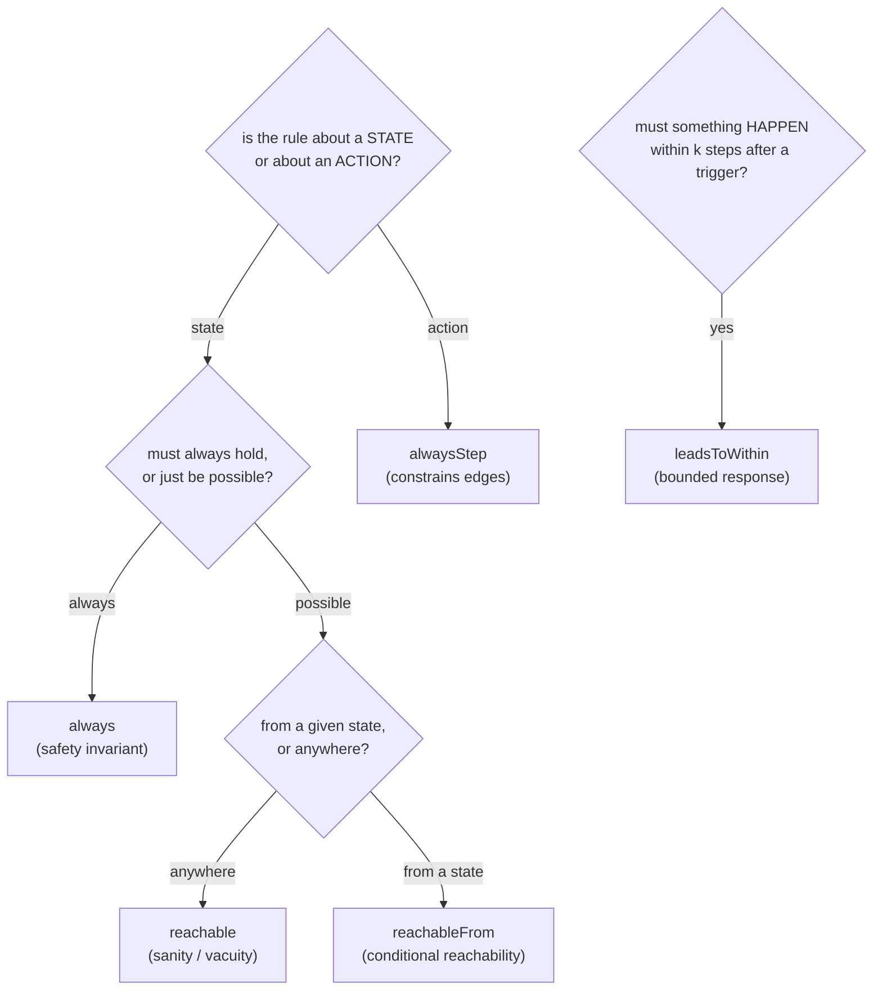

Properties live in a file such as `app.props.ts` that exports a `properties()`
function returning an array of property objects. Predicates are built from
[combinators](../concepts/properties.md) imported from `modality-ts/core` — they are
serializable data, evaluated by the [Rust checker](../architecture/checker.md), not
arbitrary functions.

```js
import {
  always, alwaysStep, leadsToWithin, reachable, reachableFrom,
  andExpr, orExpr, notExpr, eq, neq, lit, readVar, enabled,
  stepEnqueued, stepResolved,
} from "modality-ts/core";

export function properties() {
  return [ /* ... property objects ... */ ];
}
```

## Choosing the right combinator



## Pattern: state invariant (`always`)

"While on `/admin`, the session must be authenticated."

```js
{
  kind: "always",
  name: "adminRequiresAuth",
  reads: ["sys:route", "atom:sessionAtom"],
  predicate: orExpr(
    notExpr(eq(readVar("sys:route"), lit("/admin"))),
    eq(readVar("atom:sessionAtom"), lit("authenticated")),
  ),
}
```

## Pattern: action invariant (`alwaysStep`)

Prefer `alwaysStep` whenever the English says "cannot trigger" / "must not clear". The
state-invariant version is often *reachably wrong*: a guest who logs out while a request
is in flight legally produces `guest ∧ pending`.

```js
{
  kind: "alwaysStep",
  name: "guestCannotSubmit",
  reads: ["atom:authAtom"],
  predicate: {
    negate: true,
    step: stepEnqueued("api.createTodo"),
    pre: eq(readVar("atom:authAtom"), lit("guest")),
  },
}
```

The `step` matcher exposes `stepEnqueued(op)`, `stepResolved(op, outcome?)`,
`stepTransitionId(id)`, and `stepAny()`. On enqueue/resolve edges you can also read the
operation's argument snapshot (`opArgs`) to write **snapshot-staleness** rules without
temporal operators.

## Pattern: bounded response (`leadsToWithin`)

"After submitting, the order must settle to success or error within 3 environment steps."

```js
{
  kind: "leadsToWithin",
  name: "submitResolves",
  trigger: stepEnqueued("api.placeOrder"),
  goal: orExpr(
    eq(readVar("local:App.order"), lit("success")),
    eq(readVar("local:App.order"), lit("error")),
  ),
  budget: { environment: 3 },
}
```

By default only environment/library/internal steps count toward the goal. Set
`allowUserEvents: true` only when you genuinely want adversarial user interference.

## Pattern: conditional reachability (`reachableFrom`)

"From any state with a valid payment method, the review step remains reachable."

```js
{
  kind: "reachableFrom",
  name: "reviewStaysReachable",
  when: eq(readVar("local:App.payment"), lit("valid")),
  goal: eq(readVar("local:App.step"), lit("review")),
}
```

Counterexamples for `reachableFrom` are non-replayable by nature (they assert path
*absence*) — the report shows a trace to the witness `when`-state plus an exhausted-search
certificate.

## Pattern: enabledness (`enabled`)

"Logout must remain possible in every error state." `enabled(model, transitionId)` is
exact because guards are structured IR.

```js
import { enabled } from "modality-ts/core";
// inside an `always` predicate:
orExpr(
  notExpr(eq(readVar("local:App.order"), lit("error"))),
  enabled(model, "Header.logout"),
)
```

## The `reads` list

Each property may declare a `reads` array. The combinator helpers infer it from the
predicate automatically, but declaring it explicitly is recommended for clarity and for
[slicing](../concepts/state-space-control.md): it tells the checker which variables the
property depends on. An `enabled(t)` reference automatically pulls in `t`'s guard
read-set and the route variable.

## Using the model object

The `always`/`alwaysStep`/`leadsToWithin`/`reachable`/`reachableFrom` *helper functions*
take the `model` as their first argument (so they can infer reads and validate variable
IDs). If you prefer, you can also write the plain property objects directly, as shown
above — both forms are equivalent. See the
[property API reference](../reference/property-api.md).

## Naming and verdicts

Give every property a stable `name` — it is the key for trace filenames, report verdicts,
and CI gating. Verdicts are `verified-within-bounds`, `violated`, `reachable`,
`vacuous-warning`, or `error`. A `vacuous-warning` (e.g. a `reachable` premise never
witnessed, or a `leadsToWithin` trigger that never fires) is **not** a pass — investigate
it, because an over-constrained model "verifies" everything.
