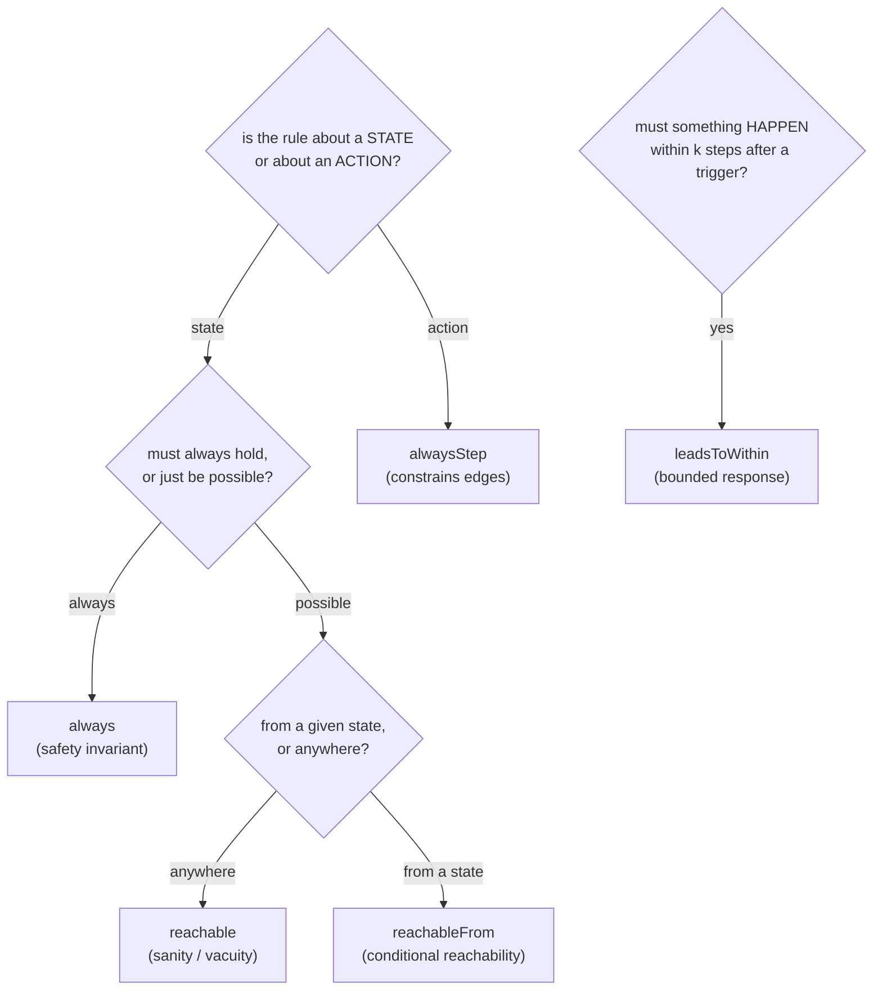

Properties live in a file such as `app.props.ts` beside the component. Import builders from
`modality-ts/properties` and call them at module top level — each call registers a spec that
the CLI loader harvests and finalizes against the extracted model. Predicates are built from
[combinators](../concepts/properties.md); they are serializable data, evaluated by the
[Rust checker](../architecture/checker.md), not arbitrary functions.

```ts
import {
  always,
  alwaysStep,
  leadsToWithin,
  reachable,
  reachableFrom,
  and,
  or,
  not,
  eq,
  neq,
  enabled,
  stepEnqueued,
  stepResolved,
} from "modality-ts/properties";
import { App } from "./App.modals";

always(
  "checkoutOnlySucceedsForUsers",
  or(not(eq(App.step, "success")), eq(App.auth, "user")),
);
```

Use `group("prefix", () => { ... })` to namespace property names.

## Choosing the right combinator



## Pattern: state invariant (`always`)

"While on `/admin`, the session must be authenticated."

```ts
import { route } from "modality-ts/vars";
import { sessionAtom } from "./store";

always(
  "adminRequiresAuth",
  or(not(eq(route, "/admin")), eq(sessionAtom, "authenticated")),
);
```

## Pattern: action invariant (`alwaysStep`)

Prefer `alwaysStep` whenever the English says "cannot trigger" / "must not clear". The
state-invariant version is often *reachably wrong*: a guest who logs out while a request
is in flight legally produces `guest ∧ pending`.

```ts
import { authAtom } from "./store";

alwaysStep("guestCannotSubmit", {
  negate: true,
  step: stepEnqueued("api.createTodo"),
  pre: eq(authAtom, "guest"),
});
```

The `step` matcher exposes `stepEnqueued(op)`, `stepResolved(op, outcome?)`,
`stepTransitionId(id)`, and `stepAny()`. On enqueue/resolve edges you can also read the
operation's argument snapshot (`opArgs`) to write **snapshot-staleness** rules without
temporal operators.

For focused postconditions on one handler, prefer a **negated bad-step** pattern:

```ts
alwaysStep(
  "submitDoesNotLeaveDraftDirty",
  {
    negate: true,
    step: stepTransitionId("Component.onSubmit"),
    post: /* bad post-state condition */,
  },
  { enabledTransitions: ["Component.onSubmit"] },
);
```

## Pattern: bounded response (`leadsToWithin`)

"After submitting, the order must settle to success or error within 3 environment steps."

```ts
import { App } from "./App.modals";

leadsToWithin(
  "submitResolves",
  stepEnqueued("api.placeOrder"),
  or(eq(App.order, "success"), eq(App.order, "error")),
  { budget: { environment: 3 } },
);
```

By default only environment/library/internal steps count toward the goal. Set
`allowUserEvents: true` only when you genuinely want adversarial user interference.

## Pattern: conditional reachability (`reachableFrom`)

"From any state with a valid payment method, the review step remains reachable."

```ts
import { App } from "./App.modals";

reachableFrom(
  "reviewStaysReachable",
  eq(App.payment, "valid"),
  eq(App.step, "review"),
);
```

Counterexamples for `reachableFrom` are non-replayable by nature (they assert path
*absence*) in the temporal formula `AG(when -> EF goal)`. The report shows the
violating `when`-state as a standard temporal counterexample.

## Pattern: advanced CTL formulas (`property` + `ctl`)

Use the named helpers above for common frontend checks. When you need a more explicit CTL
shape, register a formula with `property(name, formula, options?)` and build it with
`ctl`. Predicates are still ordinary structured expressions lifted with `ctl.holds(...)`.

```ts
import { ctl, eq, property } from "modality-ts/properties";
import { App } from "./App.modals";

property(
  "validPaymentInevitablyCanReview",
  ctl.always(
    ctl.implies(
      ctl.holds(eq(App.payment, "valid")),
      ctl.eventually(ctl.holds(eq(App.step, "review"))),
    ),
  ),
);
```

The `ctl` namespace exposes boolean formula composition (`holds`, `negate`, `allOf`,
`anyOf`, `implies`) plus CTL operators: `always` (`AG`), `canReach` (`EF`),
`eventually` (`AF`), `canStayForever` (`EG`), `afterEveryStep` (`AX`),
`afterSomeStep` (`EX`), `holdsUntil` (`AU`), and `canHoldUntil` (`EU`). For fair
temporal checks, pass `fairness: [ctl.fairlyOften(condition, name?)]` in the trailing
registration options.

## Pattern: enabledness (`enabled`)

"Logout must remain possible in every error state." `enabled(transitionId)` is exact because
guards are structured IR.

```ts
import { enabled } from "modality-ts/properties";
import { App } from "./App.modals";

always(
  "logoutAvailableOnError",
  or(not(eq(App.order, "error")), enabled("Header.logout")),
);
```

## The `reads` list

Each property may declare a `reads` array in the trailing options object. The loader infers
it from the predicate automatically, but declaring it explicitly is recommended for clarity
and for [slicing](../concepts/state-space-control.md). An `enabled(t)` reference
automatically pulls in `t`'s guard read-set and the route variable. When extraction
disambiguates duplicate handler ids with stable hash suffixes, use
`enabledTransitionPrefix(baseId)` instead of relying on the unsuffixed base id.

## Component state handles

Extraction emits one sibling handle module for each source file with `useState` locals.
Import `useState` locals from the generated `*.modals.ts` module through the component
object:

```ts
import { App } from "./App.modals";

always(
  "guestCannotReachSuccess",
  not(and(eq(App.auth, "guest"), eq(App.step, "success"))),
);
```

For example, `app/home/home.tsx` produces `app/home/home.modals.ts`. The CLI loader
rewrites and strips generated handle imports at check time.

Imported atoms and stores resolve through symbol rewriting when their declaration anchors
appear in `model.metadata.varAnchors`; otherwise use the `var` export directly, usually
with an alias such as `import { variable } from "modality-ts/properties"`.
Use `variable("swr:...")` or `variable("sys:timer:...")` for synthesized ids that do
not have a stable importable handle.

## Naming and verdicts

Give every property a stable `name` — it is the key for trace filenames, report verdicts,
and CI gating. State properties are checked as CTL temporal formulas: `always(p)` lowers
to `AG p`, `reachable(p)` to `EF p`, and `reachableFrom(when, goal)` to
`AG(when -> EF goal)`. A successful temporal property reports `verified` when the explored
graph was exhaustive and `verified-within-bounds` when the search stopped at a bound; it
does not emit a reachability witness trace. A `vacuous-warning` (e.g. a `reachable`
predicate never witnessed, or a `leadsToWithin` trigger that never fires) is **not** a pass
— investigate it, because an over-constrained model "verifies" everything. Other verdicts
are `violated` and `error`.
