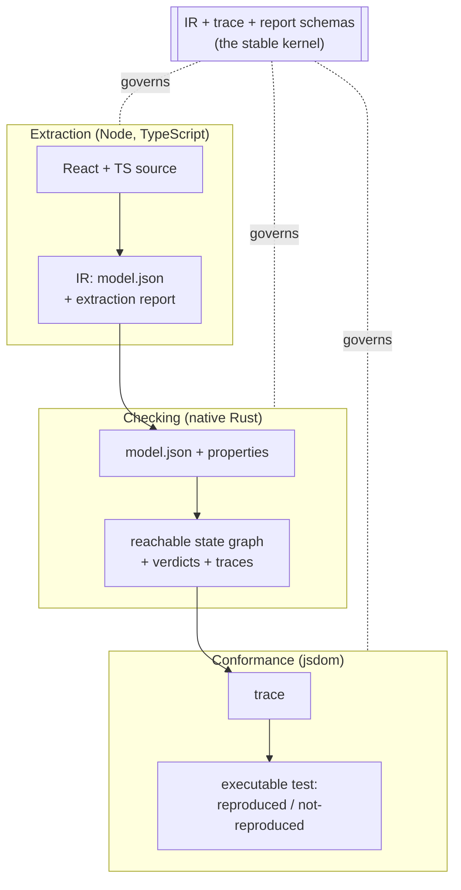

This page is the end-to-end tour. Each stage links to a deeper page.

## The four subsystems and one contract

Everything communicates through a single, schema-versioned **intermediate
representation (IR)** — the [transition-system IR](../architecture/ir.md). The
extractor produces it, the checker executes it, the exporter translates it, and the
replay generator consumes traces over it.

## Stage 1 — Extraction: source → IR

A static-analysis pipeline (P0–P7) walks the project with the TypeScript compiler
API. It builds a **state inventory** (which `useState`/atoms/stores/SWR keys/routes
exist), infers a finite [abstract domain](../concepts/state-and-domains.md) for each,
discovers event handlers and effects, and **summarizes** each handler body into
structured effects over the IR.

The governing rule is the [**E1 soundness invariant**](../soundness/e1-invariant.md):
for every concrete handler execution, either the extracted transition covers its
abstracted result, *or* the handler is classified `unextractable` and surfaced as a
TODO. The extractor may over-approximate (model a write as "could become anything"),
but it may never *silently miss* a write.

See [the extraction pipeline](../architecture/extraction-pipeline.md).

## Stage 2 — The model: a finite transition system

The output is a finite **labeled transition system** `M = (S, S₀, A, →)`:

- **States** are records mapping each variable to a value in its finite domain.
- **Transitions** are guarded, classed (`user` / `nav` / `env` / `internal` /
  `library`), and carry an event label that can drive the real app.
- **Async is split**: an initiating event *enqueues* a pending request; a separate
  *environment* transition later *resolves* it with a nondeterministic outcome and a
  nondeterministic ordering. This is where race bugs come from "for free".

See [Transitions](../concepts/transitions.md) and the [IR](../architecture/ir.md).

## Stage 3 — Checking: exhaustive BFS

The [native Rust checker](../architecture/checker.md) runs layered breadth-first
search over **macro-steps** (one observable event followed by
[run-to-completion stabilization](../concepts/stabilization.md) of `useEffect`
reactions). It:

- canonicalizes states (with token symmetry reduction) into a visited set,
- evaluates [properties](../concepts/properties.md) as monitors during the search,
- reports the **shortest** counterexample (BFS), and
- slices the model [per property](../concepts/state-space-control.md) so each property
  only pays for the state it actually depends on.

## Stage 4 — Conformance: closing the model–code gap

A verified model says nothing about an app that diverges from it. So every
counterexample trace compiles to an executable test that drives the *real* app along
the trace and classifies the result as **reproduced** (a real app bug),
**not-reproduced** (a model divergence), or **inconclusive** (harness problem).
`modality conform` additionally replays *random* model walks to keep the model honest
over time. See [Conformance & Replay](../architecture/conformance-and-replay.md).

## What you get back

Every run produces a **report** with a verdict per property plus a
[trust ledger](../soundness/trust-ledger.md): the bounds, abstractions, assumptions,
over-approximated/manual/unextractable transitions, and bound-hit events the verdict is
conditional on. The verdict is only ever "**verified within these stated bounds**" — and
the ledger is where the bounds are stated, honestly, in one place.
