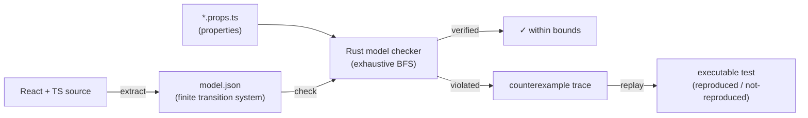

`modality-ts` is a **model-checking-based testing tool for React**. It extracts a
finite state-transition model from your TypeScript + React source, checks
developer-defined properties against **every reachable state within stated
bounds**, and turns any counterexample into a replayable trace.

It is a third testing layer, sitting beside the ones you already have:

| Layer | What it verifies | What it samples |
| --- | --- | --- |
| Unit tests | value computation inside functions and handlers | one input at a time |
| Component / golden / visual | rendering: `UI = f(state)` for chosen states | a few states |
| End-to-end (Playwright/Cypress) | a handful of real, linear paths | one interleaving each |
| **modality-ts** | **all event interleavings of the modeled state layer, within bounds** | *exhaustive* within the model |

The premise is `UI = f(state)`. Existing tools are good at testing `f`
(rendering, value logic). `modality-ts` verifies the **state-transition side** —
the part where out-of-order responses, double submits, back-button auth bypass,
and stale-cache-after-logout bugs actually live. These are *interleaving* bugs;
example-based tests check one interleaving each, and the interesting failures
hide in the interleavings nobody wrote a test for.

## The shape of the tool

1. **Extract** — static analysis turns supported React/TS patterns into a finite
   [transition-system IR](../concepts/transition-system.md): state variables with
   finite [domains](../concepts/state-and-domains.md), and guarded
   [transitions](../concepts/transitions.md) labelled with the user-meaningful
   events that drive them.
2. **Check** — a [native Rust model checker](../architecture/checker.md) explores
   the reachable state graph exhaustively (within bounds) and evaluates
   [properties](../concepts/properties.md). Counterexamples are *shortest* by
   construction (BFS).
3. **Replay** — counterexample traces compile to executable tests. Replaying
   against the real app is also how the tool [keeps the model
   honest](../architecture/conformance-and-replay.md).

## What it honestly is — and is not

`modality-ts` is built on one architectural admission: **fully automatic model
extraction from arbitrary React is infeasible.** The design instead commits to:

- **Extraction-assisted modeling.** The extractor classifies each transition as
  `exact`, `over-approx`, or `unextractable`. It may over-approximate freely (sound
  for safety properties), but it **never silently guesses** a missed write — that is
  the one failure mode a verification tool must not have. See the
  [E1 soundness invariant](../soundness/e1-invariant.md).
- **Conformance testing closes the model–code gap.** A verified model proves nothing
  about an app that diverges from it, so every model trace can be replayed against the
  real app. See [Conformance & Replay](../architecture/conformance-and-replay.md).

> **What it can guarantee:** within the stated bounds, abstractions, and environment
> assumptions, *no reachable model state violates the properties* — exhaustively,
> including every async interleaving.
>
> **What it cannot guarantee:** rendering correctness, handler value-computation,
> anything beyond the bounds, behaviour of unmodeled code, and — fundamentally — that
> the model matches the app (conformance is *tested*, never proven).

Read [Soundness & Validity](../soundness/index.md) before you trust a verdict in CI.

## Good fits

- Components driven by local `useState` flows.
- Apps using supported sources — [`useState`](../sources/use-state.md),
  [Jotai](../sources/jotai.md), [SWR](../sources/swr.md),
  [Zustand](../sources/zustand.md), [router state](../sources/router.md).
- Finite domains, bounded collections, finite numeric ranges, and named side effects.
- Business rules expressible as safety properties over reachable states.

## Weak fits

DOM layout, CSS, animation timing, canvas rendering, browser quirks, unbounded data
without declared abstractions, and external services not modeled as effects. For those,
keep using unit/integration/E2E tests — `modality-ts` complements them, it does not
replace them.

## Library & framework compatibility

✅ supported today · ❌ not supported (🔜 = on the roadmap). A library is "supported"
when extraction has a built-in [source plugin or adapter](../architecture/state-sources.md)
for it; unsupported state libraries are not silently misread — their writes become a
loud [taint](../soundness/e1-invariant.md), never a false "verified".

| Library | | Notes |
| --- | :---: | --- |
| React | ✅ | the target; modeled at [event granularity](../concepts/transition-system.md#granularity-event-level-not-render-level) |
| TypeScript | ✅ | required — domains are inferred from types |
| Plain JavaScript | ❌ | no types means no domain inference |
| Next.js | ✅ | built-in [navigation adapter](../sources/next.md) for App Router and Pages Router; server execution is modeled as nondeterministic async effects |
| Remix | ❌ 🔜 | no built-in Remix adapter yet; routing via React Router is supported |
| `useState` | ✅ | [route-scoped local state](../sources/use-state.md) |
| Jotai | ✅ | [atoms, derived/utility atoms, store scoping](../sources/jotai.md) |
| Zustand | ✅ | [stores, actions, middleware, immer drafts](../sources/zustand.md) |
| `useReducer` | ❌ 🔜 | warned, not modeled (reducers are good extraction material) |
| Redux | ❌ 🔜 | no built-in source yet |
| XState | ❌ 🔜 | designed to [fit the plugin contract](../architecture/state-sources.md#capability-matrix) (machines *are* transition systems) |
| React Context (as state) | ❌ | writes are unanalyzable — stays a documented [taint](../soundness/limitations.md), not a plugin |
| MobX / Recoil | ❌ | no source plugin |
| SWR | ✅ | [hand-written cache template](../sources/swr.md) (lifecycle, revalidation, stale-on-error) |
| `fetch` / named effect APIs | ✅ | [async split into enqueue + resolve](../concepts/transitions.md#async-split-transitions) |
| TanStack Query | ❌ 🔜 | template effort like SWR; fits the contract |
| React Router | ✅ | the built-in [navigation adapter](../sources/router.md) |
| TanStack Router | ✅ | the built-in [navigation adapter](../sources/tanstack-router.md) |
| Zod | ✅ | static `z.number().int().min(a).max(b)` via [type-library adapter](../architecture/type-library-adapters.md) |
| ArkType | ✅ | static `"a <= number.integer <= b"` via [type-library adapter](../architecture/type-library-adapters.md) |
| Valibot | ❌ 🔜 | no adapter yet |
| Yup | ❌ | no adapter |

> Schema libraries are used to derive [finite numeric domains](../concepts/state-and-domains.md#finite-numeric-domains)
> from statically provable integer bounds.
>
> Missing a library? Because [plugins contribute IR instances, not new
> semantics](../architecture/state-sources.md), most state libraries can be added as a
> single new source slice — see [State sources & the plugin SPI](../architecture/state-sources.md).

## Next steps

- [Install](./installation.md) and run the [Quickstart](./quickstart.md).
- Understand [how it works](./how-it-works.md) end to end.
- Learn the [concepts](../concepts/index.md) behind the model.
