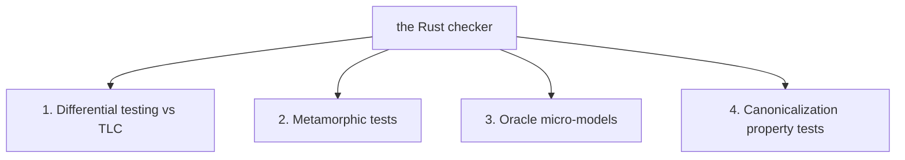

The [checker](../architecture/checker.md) is part of the trusted base: if it is wrong,
every verdict is wrong. A custom checker forgoes 25 years of mature engine engineering
(partial-order reduction, symmetry, symbolic states), so the trade-off is accepted only
because it is paired with the **heaviest internal testing in the project**. The checker
core is kept small, and validated four ways.

## 1. Differential testing against TLC (primary)

A corpus of **structured-only** models (hand-written, real extraction outputs, and
randomly generated IR within domain bounds) is exported via
[IR → TLA+](../guides/exporting-to-tla.md) and run through TLC. The tool then asserts:

- identical **reachable-state counts**,
- identical **invariant verdicts**, and
- cross-validated counterexamples — our trace must be admissible in TLC's model, and vice
  versa.

Random IR generation is cheap and high-yield here because the IR is small, and it runs in
the tool's own CI (`pnpm phase7` drives the differential runner). This is the direct
mitigation for "what if the custom checker has a bug?": an independent, battle-tested
checker agrees on the same models.

> Differential testing uses structured-only models because TLA+ export turns
> [opaque effects](../architecture/ir.md#the-opaque-escape-hatch) into `havoc` — so a
> model with opaque effects is no longer the *same* model on both sides. The structured
> core is exactly the part that must agree exactly.

## 2. Metamorphic tests

Properties of the checker that must hold regardless of the specific model:

- adding an always-false-guard transition changes **nothing**;
- splitting an enum value into two that are never distinguished changes **no verdicts**;
- **slicing on vs off** produces identical per-property verdicts.

Metamorphic relations catch whole classes of bugs (e.g. a slicing bug that drops a
relevant transition) without needing a known-correct answer for any single model.

## 3. Oracle micro-models

Classic, hand-checkable models — dining-philosophers-grade — with **known** state counts
and **known** counterexamples, encoded directly in the IR. These pin down absolute
correctness on small inputs where the right answer is independently known.

## 4. Canonicalization property tests

The visited-set encoding is the one place a subtle bug becomes *silent unsoundness* (two
distinct states colliding would drop a state). So canonicalization is property-tested:

- `decode ∘ encode = identity`;
- token renaming is **idempotent** and **equality-preserving** (a state where everything
  is `t₂` and one where everything is `t₁` canonicalize identically, but cross-variable
  token equality is preserved).

The checker also **never** uses hash-only set membership: any hashed visited set keeps a
full-encoding collision check, because a hash collision would silently drop states.

## Determinism as a testable property

Because the checker is [deterministic](../architecture/checker.md#determinism) — sorted
iteration orders, no wall-clock dependence — "two runs produce identical results and
identical counterexamples" is itself a hard, testable requirement, and a prerequisite for
both CI reproducibility and the differential corpus.

## What this does and does not buy

These four layers make a *checker* bug unlikely and *detectable*. They say nothing about
whether the **model** matches the **app** — that is the
[conformance](../architecture/conformance-and-replay.md) story, and a separate gap. The
two together are what let the tool claim "verified within bounds" with a straight face.
