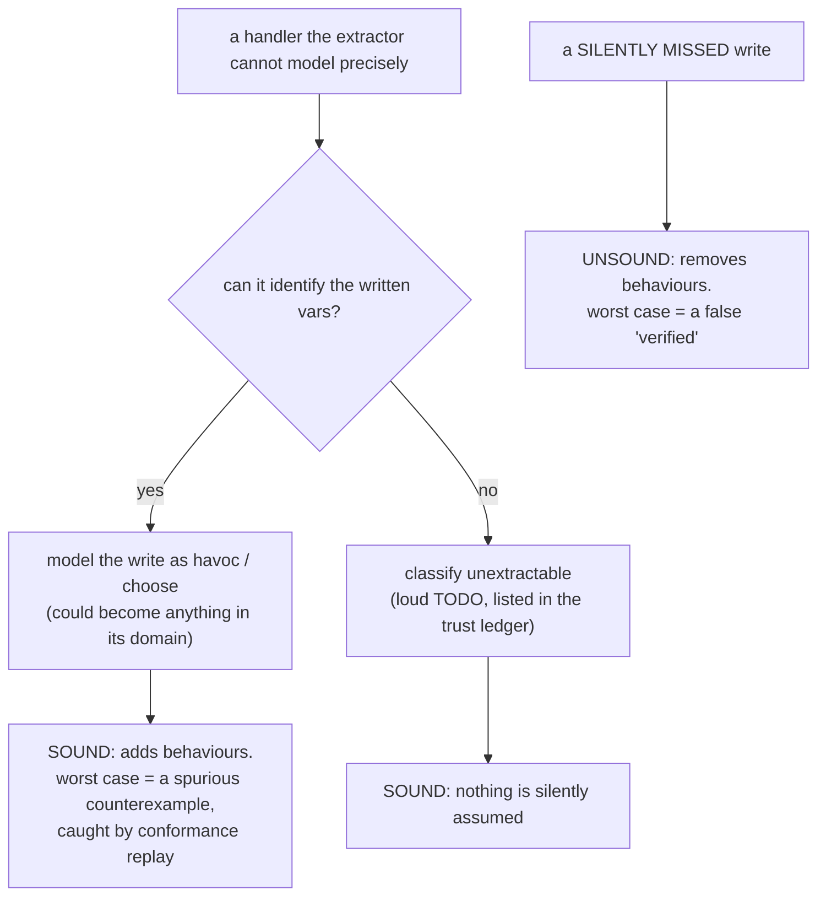

Everything about extraction is organized around one rule:

> **Soundness invariant (E1).** For every concrete execution of an app event handler,
> either the extracted transition's successor set **covers** the abstracted result of
> that execution, or the handler is classified `unextractable` and surfaced as an
> overlay TODO. The extractor may over-approximate freely; it may never silently
> under-approximate.

## Over-approximation is safe; missed writes are fatal

For safety properties (`always`, `alwaysStep`), the directions are asymmetric:

- **Over-approximation adds behaviours.** The model admits *more* transitions than the
  app. For a safety property, exploring extra behaviours can only produce *spurious
  counterexamples* — never a false "verified". And a spurious counterexample is caught
  when [conformance replay](../architecture/conformance-and-replay.md) returns
  `not-reproduced`.
- **A silently missed write removes behaviours.** The model admits *fewer* transitions
  than the app. That can hide a real violating state, producing a **false "verified"** —
  the one failure mode a verification tool must not have.

So the entire extraction pipeline is biased: when in doubt, over-approximate loudly or
bail out — never assume.

## How the pipeline enforces E1

The enforcement lives mainly in two phases (see the
[extraction pipeline](../architecture/extraction-pipeline.md)):

- **P4 — effect summarization.** Code outside the M0 subset does not silently disappear.
  A non-representable write of a finite-domain type becomes `havoc`; a non-representable
  condition becomes a nondeterministic `choose` over both branches. Only when the write
  *target itself* is unidentifiable does the handler become `unextractable`.
- **P5 — escape analysis.** Modeled state is writable only through known channels
  (setters, atom/store setters, SWR `mutate`). A write channel that escapes
  summarization **taints** its variable (handler-local `havoc`) or, if it escapes the
  handler entirely, becomes a **global taint**: an always-enabled `env` transition that
  can `havoc` the variable at any time. Global taints make most properties about that
  variable unverifiable — and that is *correct*, because the code genuinely admits
  arbitrary writes.

## Classification, surfaced honestly

Every handler is classified, and the classification is part of the
[trust ledger](./trust-ledger.md):

| Classification | Meaning | Effect on the verdict |
| --- | --- | --- |
| `exact` | summarized precisely | none |
| `over-approx` | summarized with `havoc`/`choose`/unrestricted guard | may yield spurious counterexamples |
| `unextractable` | could not be summarized; needs an overlay | listed as a warning; affected transitions named |
| `manual` | supplied by an [overlay](../guides/refining-domains-and-overlays.md) | trusted human input, flagged |

An `unextractable` handler without an overlay entry or explicit `ignore` is a check-time
warning — not a silent omission.

## The corollary for plugin authors

The [plugin SPI](../architecture/state-sources.md) preserves E1 by construction in all
but one place. A plugin that **under-declares** its `writeChannels` causes its writes to
look like unknown calls → taint → noise (safe). The single dangerous spot is
`summarizeWrite` returning *wrong* IR for a recognized write — which is precisely what
[per-transition conformance pass-rates](../architecture/conformance-and-replay.md) exist
to detect.

## Caveats are typed

Extraction caveats are not free-text; they have kinds —
`global-taint`, `stale-read`, `unhandled-rejection`, `unextractable`, `model-slack` —
and a severity (`info` / `over-approx` / `unsound-risk`). This lets CI gate on, say, a
*new* `unsound-risk` caveat appearing, rather than treating all warnings alike. See
[the trust ledger](./trust-ledger.md).
