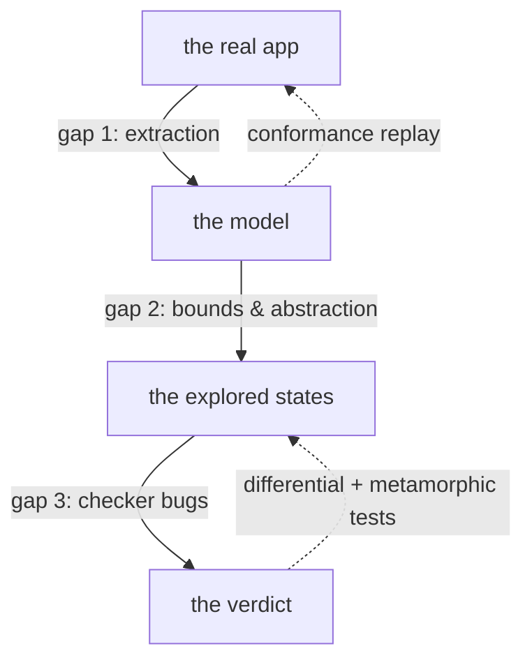

A verification tool earns its name by being honest about exactly what it proves. This
section is the one to read before you trust a verdict in CI. It answers: *what does
"verified" mean here, how does the tool avoid lying, and where are the edges?*

## What a verdict means

The only claim `modality-ts` ever makes is:

> **Verified within these stated bounds, abstractions, and environment assumptions: no
> reachable model state violates the property.**

Every qualifier in that sentence is load-bearing, and every one is recorded in the
[trust ledger](./trust-ledger.md). "Verified" with no qualifiers is never on offer.

## The three gaps between "verified" and "correct"

| Gap | Risk | How it is managed |
| --- | --- | --- |
| **Extraction** — the model may not match the app | a *missed write* yields a false "verified" | the [E1 invariant](./e1-invariant.md): over-approximate, never silently miss; classify and report |
| **Bounds & abstraction** — exploration is finite | a bug beyond the bounds is invisible | bounds are [explicit and reported](./trust-ledger.md); a bound-hit is an error, not a pass |
| **Checker** — the checker itself could be wrong | a checker bug invalidates everything | [differential / metamorphic / oracle testing](./checker-correctness.md) |

## The two design commitments

1. **Extraction-assisted modeling, not automatic extraction.** The tool extracts a state
   inventory and transition skeleton, classifies each transition as
   `exact` / `over-approx` / `unextractable`, and asks the developer to resolve the last
   category. It must never silently guess. See [the E1 invariant](./e1-invariant.md).
2. **Conformance testing closes the model–code gap.** Because every transition is
   labelled with concrete app events, any model trace compiles to an executable test;
   counterexamples are replayed against the real app, and the model is periodically
   re-validated by random-walk replay. See
   [Conformance & replay](../architecture/conformance-and-replay.md).

> Verification of the model **plus** testing of conformance is the honest contract.
> "Verification of the app" is not, and the tool must never market itself as the latter.

## Pages in this section

- [The E1 soundness invariant](./e1-invariant.md) — why over-approximation is safe and
  missed writes are fatal.
- [The trust ledger](./trust-ledger.md) — the honesty artifact every run produces.
- [Checker correctness](./checker-correctness.md) — how the trusted core is itself
  validated.
- [Limitations](./limitations.md) — the documented edges and exclusions.
