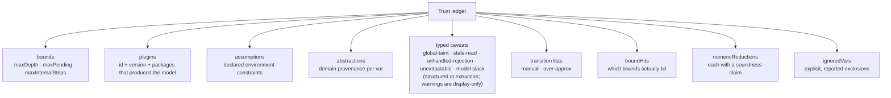

The trust ledger is the tool's **honesty artifact**: a single place that lists
everything a "verified within bounds" verdict is conditional on. It is assembled during
extraction and embedded in every check report (`ReportTrustLedger` in
`src/core/report/types.ts`). If you read one thing before trusting a green run, read the
ledger.

## What it contains

| Field | Why it matters |
| --- | --- |
| `bounds` | the verdict holds only up to these limits; a deeper bug is invisible |
| `plugins` | a plugin is trusted code — the report must say which ones produced the model |
| `assumptions` | `assume()` constraints on the environment are part of the trust base |
| `domains` | per-var domain kind + provenance (`type-derived` / `default-token` / `overlay-refined` / `template` / `system`) |
| `globalTaints` | vars that admit arbitrary external writes — properties about them are weak |
| `staleReads` | continuations reading vars that may have changed since enqueue |
| `unhandledRejections` | error paths with no continuation (often a real bug) |
| `unextractableHandlers` | handlers that need an overlay; their transitions are missing or `havoc`'d |
| `modelSlack` | wide domains, unprovable array lengths, field-pruning over-approximations, and other search-enlarging caveats |
| `manualTransitions` / `overApproxTransitions` | which transitions are human-supplied vs over-approximated |
| `boundHits` | which bounds *actually* bit this run (a bound that never binds adds no caveat) |
| `numericReductions` | each finite-numeric reduction with its claim (`exact` / `property-preserving` / `heuristic`) |
| `ignoredVars` | explicit, reported exclusions (`ignoreVar(...)`) |

## Bound-hit events

A "bound that bit" is the difference between a real proof and an artifact. Examples:
token exhaustion (a domain ran out of distinct identities), pending-cap saturation (`K`
concurrent operations reached), SWR key-window eviction. Each such event is listed — so
a verdict that *looks* exhaustive but quietly truncated is visible. A bound that never
bound is **not** listed, because it added no caveat.

## Coverage and provenance

The extraction report also records coverage — the percentage of discovered handlers that
are `exact` + `overlay`, and the count of ignored vars — and the provenance of every
domain. Effect-operation provenance (where a network operation was discovered) is recorded
too. The point is to make the question "how much of my app is actually modeled, and how
precisely?" answerable from one file.

## Warnings vs structured caveats

Extraction and check reports carry both typed `ExtractionCaveat` arrays and parallel
`warnings: string[]` for human terminal output. **Warning strings are not machine-readable
trust data.** Trust-affecting facts (`global-taint`, `model-slack`, `unextractable`, …)
must be created as structured caveats at the extraction site and partitioned into the
ledger fields. Production report code must not parse warning prefixes or regex-match
`warning.message` to recover caveat identity — see [the E1 invariant](./e1-invariant.md).

## Using the ledger in CI

Because caveats are [typed and severity-tagged](./e1-invariant.md), CI can gate on
*changes* to the ledger rather than treating it as advisory prose:

- a **new** `global-taint` or `unsound-risk` caveat → fail (the model just got weaker);
- a **new or removed** `modelSlack` entry → fail (`modality ci` compares caveat ids);
- a drop in conformance pass-rate per transition → fail (the model drifted from the app);
- a stale model hash (code changed under an unregenerated model) → fail.

This turns the ledger into a *ratchet*: the model's honesty can only improve, or the
build breaks. See [CI integration](../guides/ci-integration.md).
