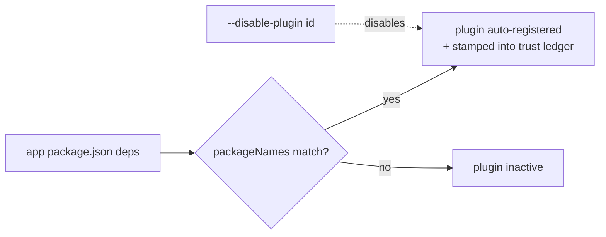

A *state source* is a library or React mechanism that holds modeled state.
`modality-ts` ships six built-in sources plus first-class modeling of several React
features. Each is a [vertical slice](../architecture/state-sources.md) implementing the
public plugin contract, activated when its package appears in your dependencies (and
disable-able with `--disable-plugin <id>`).

In addition to state sources, `modality-ts` ships **handler-wrapper adapters** for form
libraries that wrap user callbacks. These do not contribute state variables but unwrap
custom submit/action wrappers so that the inner callback body is extractable.

## Capability matrix

| Source | What is modeled | Observation in replay | Template |
| --- | --- | --- | --- |
| [`useState`](./use-state.md) | local component state, route-scoped | DOM projection / probe transform | none |
| [Jotai](./jotai.md) | atoms, derived/writable atoms, utility atoms, store scoping | store handle (direct) | none |
| [SWR](./swr.md) | per-key cache lifecycle, revalidation, dedup, stale-on-error | cache `Map` (direct) | **yes** (hand-written) |
| [Zustand](./zustand.md) | store fields, actions, `set`/`get`, middleware, immer drafts | store handle (direct) | none |
| [TanStack Query](./tanstack-query.md) | query/mutation cache, QueryClient APIs, aggregates | `QueryClient` handle (direct) | **yes** (hand-written) |
| [Router](./router.md) | routes, navigation intents, history | router test API | location semantics |
| [TanStack Router](./tanstack-router.md) | file/code route trees, loaders, bounded loader cache | router harness + branch vars | location + tree semantics |
| [Next.js](./next.md) | App/Pages routes, route-tree slots, server effect APIs | router harness + slot vars | location + tree semantics |
| [React features](./react-features.md) | timers, effects, batching, stale closures, concurrent, Suspense | — | — |

## Handler-wrapper adapters

| Adapter | What is unwrapped | Entry point |
| --- | --- | --- |
| [React Hook Form](./react-hook-form.md) | `form.handleSubmit(cb)`, destructured `handleSubmit(cb)` | `modality-ts/extract/sources/react-hook-form` |

## How a source becomes active

Every active plugin's id + version is recorded in the
[trust ledger](../soundness/trust-ledger.md) — a plugin is trusted code, so the report
must say which ones produced the model.

## A shared safety guarantee

For all sources, the [E1 invariant](../soundness/e1-invariant.md) holds the same way: a
write through a channel the plugin **did not declare** is seen as an unknown call and
becomes a [taint](../architecture/extraction-pipeline.md#p5--escape-analysis-the-e1-enforcer)
(loud over-approximation), never a silent miss. The one place a plugin can be *wrong*
rather than merely *noisy* — translating a recognized write into the wrong IR — is exactly
what [per-transition conformance](../architecture/conformance-and-replay.md) measures.
