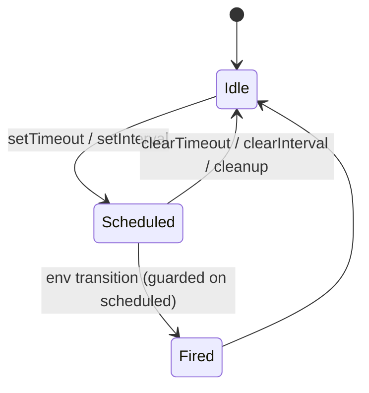

Beyond state libraries, several React features have real timing and ordering semantics
that affect correctness. `modality-ts` models them end to end (extraction → IR →
checker), all expressed with the **existing closed IR** — no new node kinds. The
soundness rule is unchanged: never silently under-approximate a write; over-approximate
loudly.

## Timers

`setTimeout` / `setInterval` become a per-registration `sys:timer:*` state machine.

Firing is an `env` transition (so it interleaves with user events and async resolves);
`clearTimeout`/`clearInterval` and effect-cleanup cancel it. This is how "the timer fired
mid-submit" surprises get caught.

## Effects and commit-phase ordering

`useEffect`, `useLayoutEffect`, and `useInsertionEffect` bodies that write modeled state
all become [`internal` transitions](../concepts/stabilization.md) with `triggeredBy`
dependency vars. They carry a `phase` ordinal so layout/insertion effects (phase 0)
stabilize before passive effects (phase 1). When two enabled effects have conflicting
write sets at the same phase, **both orders are explored** — React promises no ordering
across independent components, so the model must not invent one.

## Batching

React-18 auto-batching is modeled faithfully via the `readPre` IR node:

- **direct closure reads** in a handler see the **render snapshot** (the macro-step
  pre-state) — `readPre`;
- **functional updaters** `setX(p => …)` chain through the accumulator — `read`.

So `setCount(c => c + 1); setCount(c => c + 1)` adds 2, while `setA(x); setB(x)` reading
the same captured `x` does not over-count. `flushSync` opts a region out of snapshot
batching (reads compile to current state).

## Stale closures

A handler reads the values captured at render. The model matches React for the
synchronous prefix, but after an `await` real code sees **stale** captures while naive
modeling would read current state. The read-set is therefore snapshotted into the pending
operation's `args` at enqueue and read via the `readOpArg` node in continuations — so the
continuation sees the value as of enqueue time. Vars at risk are flagged as `stale-read`
caveats, and [conformance replay](../architecture/conformance-and-replay.md) is the
arbiter.

## Concurrent rendering

- `useTransition` / `startTransition` — a deferred commit with an `isPending` bool
  (reusing the pending-op queue), modeled as *interruptible deferral* (interleaving), not
  React's exact lane priorities.
- `useDeferredValue` — a lagging mirror variable synced by an internal transition.
- `flushSync` — a batching opt-out (reads compile to current, not snapshot).

> Tearing windows and `isPending` are captured; exact lane order is not — that is
> invisible at [macro-step granularity](../concepts/stabilization.md).

## Suspense

A `<Suspense>` boundary is a `sys:suspense:*` `ready` / `suspended` state variable. A
suspending `use(promise)` / `React.lazy` / data read enqueues a resolve op and **gates**
the subtree's transitions (`guard: boundary === ready`); fallback interactions are enabled
while suspended. SWR under Suspense routes through the boundary resolve instead of the
focus-revalidate env model.

```mermaid
stateDiagram-v2
  [*] --> Ready
  Ready --> Suspended: child suspends (enqueue resolve op)
  Suspended --> Ready: resolve (env)
  note right of Suspended: subtree transitions gated;<br/>fallback interactions enabled
```

## Finite numeric domains

Numbers can be finite *state* when their domain is statically provable
([State & domains](../concepts/state-and-domains.md#finite-numeric-domains)):

- literal unions are **exact** (`0 | 2` → `intSet {0,2}`, never widened);
- branded aliases (`Bounded<Min,Max>`, `Uint8`/`Byte`, `Uint16`, `Short`) carry static
  ranges;
- static `zod` (`z.number().int().min().max()`) and `arktype` schemas are read;
- the checker evaluates numeric comparisons (`lt`/`lte`/`gt`/`gte`) and arithmetic
  (`add`/`sub`/`mod`) with an **overflow policy** (`forbid`/`wrap`/`saturate`) — reachable
  overflow is explored, not erased;
- unprovable constraints **abstain** to `tokens(1)` + a caveat (a wrong bound would be
  unsound).

Wide numeric domains can be tamed with [claim-tagged reductions](./../guides/refining-domains-and-overlays.md#taming-finite-numeric-state).

## What stays out

Render internals (reconciliation, fiber bailouts, StrictMode double-invoke) are invisible
at event granularity and stay out by design. See [Limitations](../soundness/limitations.md).
