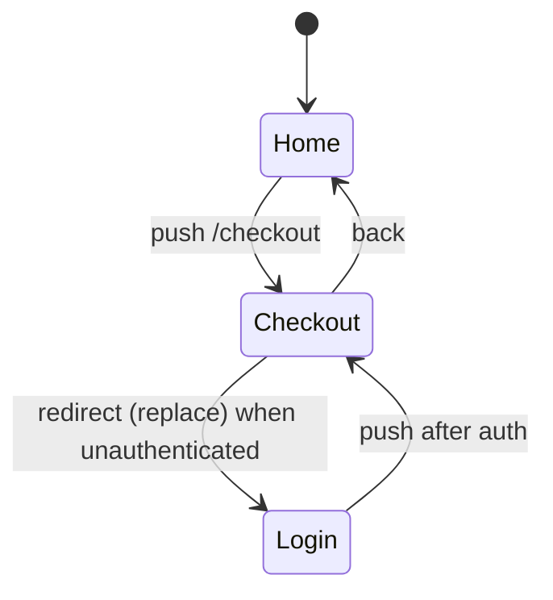

Routing is modeled through a **framework-agnostic adapter** rather than a state-source
plugin, because exactly one router is active per app. The full design is in the
[Navigation architecture](../architecture/navigation.md) page; this page is the
user-facing summary.

## What is modeled

- **`sys:route`** — the current route, a finite enum derived from the **route manifest**
  (not scavenged from literal navigation targets), covering `page` and `index` routes.
- **`sys:history`** — a bounded back-stack (`maxHistory` default 4) for back-button
  behaviour, with a [soundly reduced inner domain](../architecture/navigation.md#history-domain-reduction-sound).
- **Navigation intents** — `push` / `replace` / `back`, classified by the adapter from
  navigation calls and JSX (`<Link>`).
- **Redirects** — a loader/route `redirect(T)` lowers to an automatic route-bound
  `replace` transition; no new IR is needed.

## Why routes drive bugs

Navigation interleaves with everything else, which is what makes back-button auth-bypass
bugs findable: "log out, then press back, and an authed route is reachable" is a path the
checker explores exhaustively. Auth-guard redirects are
[internal transitions](../concepts/stabilization.md) fired during stabilization, so the
model captures "the redirect happens before the user can act".

## Route coverage report

Routes that are **not** modeled — `layout` and `resource` (API / `.ts`) routes — are
listed with a reason in the route-coverage report, so you can see exactly which parts of
the manifest entered `sys:route` and which did not.

## Supported frameworks

**Next.js** (`nextAdapter()`) activates when `next` is in your dependencies. It
discovers App and Pages Router routes from the filesystem and models optional
route-tree state for layouts, parallel slots, and intercepting routes. See
[Next.js source](./next.md).

**TanStack Router** (`tanstackRouterAdapter()`) activates when
`@tanstack/react-router` is in your dependencies and Next is absent. It discovers
file-based and static code-based route trees, models loader/beforeLoad effect APIs,
and optional branch/loader-cache vars. See [TanStack Router source](./tanstack.md).

**React Router** (`reactRouterAdapter()`) is used when neither Next nor TanStack
Router is active. Export
`reactRouterModuleRoleAdapter()` and `reactRouterEffectApiProvider()` when
registering a custom bundle. The engine itself contains **no**
framework-specific identifiers — it only calls the adapter — so other frameworks can
be supported by writing a new adapter, with no engine changes. See
[Navigation](../architecture/navigation.md).

## Default scope

Default extraction models **client UI transitions** only. Server/full-route execution
(loaders, actions, initial data loading) is future work; server-only modules are excluded
from the client model so they do not inflate it.
