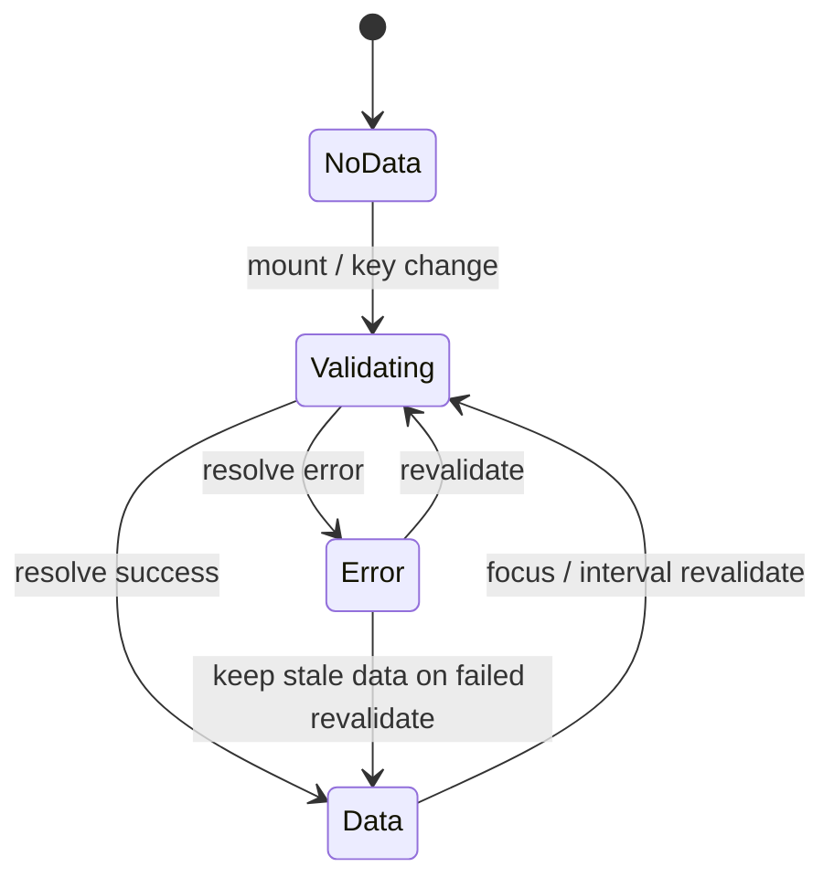

SWR is **not extracted** — it is modeled *once, by hand*, as a parameterized
[template](../architecture/ir.md#library-templates) instantiated per cache key. This is
the standard model-checking move for trusted runtimes: analyzing SWR's source would be far
less sound than carefully modeling its well-understood per-key state machine.

## The per-key state machine

Per key class the template models:

- `data: ⊥ | P` where the payload domain `P = D(fetcher return type)` — a fetcher
  returning `Todo[]` yields `data ∈ {⊥, '0', '1', 'many'}`, so properties can distinguish
  loaded-empty from loaded-some;
- `isValidating: bool`, `error: option`;
- mount / key-change-triggered fetch, with the dedup window as a boolean;
- `revalidateOnFocus` as an `env` event (on/off per options);
- `mutate(key)` API effects;
- **stale-data retention on error** — a failed revalidation sets `error` but keeps
  `data` (real SWR behaviour, and a state combination property authors forget exists).

## Key classification

`useSWR` keys are classified at extraction:

| Key shape | Result |
| --- | --- |
| string literal | exact key class |
| template literal / tuple (`['todos', userId]`) | key class parameterized by the abstract non-literal elements — this is what makes **stale-cache-across-identity** bugs expressible |
| conditional (`cond ? key : null`) | guards the template's fetch transitions |
| multi-parameter | instantiated against the bounded **key window** (below) |
| dynamically computed beyond the subset | `unextractable` (a havoc'd cache is useless) |

## Multi-parameter keys and the key window

A key spanning several abstract variables would instantiate the template once per
combination — a state-space multiplier with no payoff. Instead the template keeps full
entries only for a **bounded window** of recently-current keys (default current +
previous); evicted entries collapse to a summary, and a key re-entering after eviction
gets a `havoc`'d entry (sound over-approximation) while key-change revalidation still
fires. Evictions are bound-hit events in the [trust ledger](../soundness/trust-ledger.md).

## Two load-bearing invariants

Every cache-shaped template guarantees, by construction:

1. **Per-key isolation** — a resolve writes only to its op's key entry, never to "the
   current view"; and
2. **the view reads the current key only**.

Staleness properties ("an old response must not become the valid quote for the current
cart") hold or fail through these two rules — so they are **template invariants**,
established once by the template's own differential tests, not re-derived per app.

## Hook-view projection

The template exports `swrView(s, key)` returning `{ data, error, isLoading,
isValidating, loadedSome, active, … }` — exactly what the component's hook call returns
(`active: false` when the key is currently `null`). Properties read the same projection
the application code reads, instead of raw template variables.

## The template is trusted code

Because the template is hand-written, it is part of the trusted base and gets its own
[conformance probes](../architecture/conformance-and-replay.md) against the **real** SWR
library, run against pinned versions in CI. The template carries a `testedVersions` range
that `modality extract` checks against the app's lockfile.
