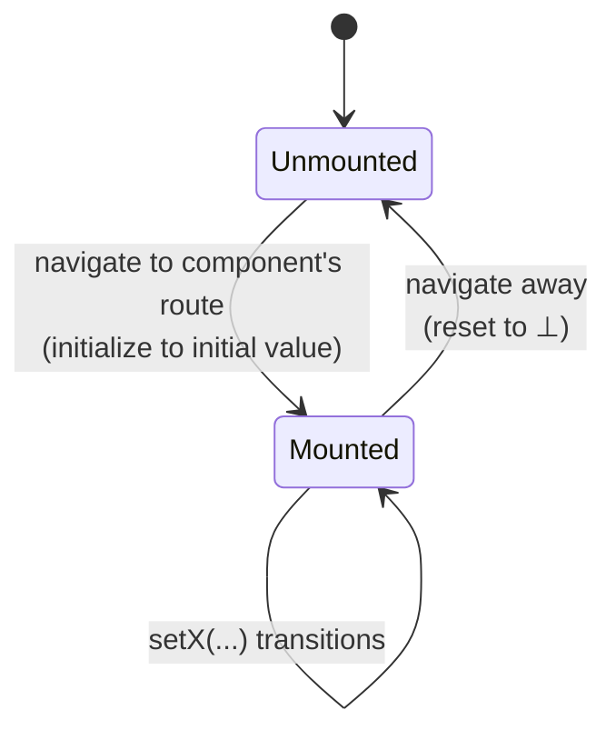

Local component state via `useState` is the foundational source. Variables are named
`local:<Component>.<stateName>` and are **route-scoped**: they exist only while the
component is mounted, holding `⊥` otherwise.

## What is extracted

- Every `useState` call in a component reachable from a route root (a call-graph walk
  over JSX element types, depth-capped with bail-and-report).
- The destructured `[x, setX]` names; the **setter symbol** (not its name) is what
  [escape analysis](../architecture/extraction-pipeline.md#p5--escape-analysis-the-e1-enforcer)
  tracks.
- The domain via [`D(τ)`](../concepts/state-and-domains.md) from the state's type — a
  `'idle' | 'loading' | 'error'` union is an exact `enum` with no abstraction needed.

## Route-local lifecycle

"Local state resets on remount" is a [semantics of the IR](../concepts/transition-system.md#route-local-variables-and-),
not something each effect must remember.

## Writes and batching

`setX(e)` and functional updaters `setX(prev => e)` are summarized by the
[M0 interpreter](../architecture/extraction-pipeline.md#p4--effect-summarization-the-m0-subset).
React-18 batching is modeled faithfully: direct closure reads see the macro-step
pre-state snapshot (`readPre`), while functional updaters chain through the accumulator —
so `setCount(c => c + 1); setCount(c => c + 1)` increments by 2, but `setX(a); setX(b)`
where both read the same captured value does not over-count. See
[React features](./react-features.md#batching).

## The one structural restriction

A modeled stateful component must render **at most once per route**. Stateful list items
(`items.map(<Row/>)` where `Row` has its own `useState`) are detected and their variables
downgraded to `unextractable` — there is no single state identity for them. (List-rendered
*handlers* that close over items but carry no hooks are fine — they become an
[indexed family](../architecture/extraction-pipeline.md#p3--handler-discovery).)

## Observation in replay

`useState` is **not externally observable**, so [replay](../architecture/conformance-and-replay.md)
needs one of two mechanisms for properties that read it:

1. **DOM projection** (default) — declare `observe("local:Comp.var", { dom, parse })`
   reading the rendered output. Honest but partial (it observes `f(state)`).
2. **Probe transform** (opt-in) — a test-only transform that mirrors modeled `useState`
   values into a test-visible registry. Full fidelity, zero production cost, but build
   machinery.

Properties reading only directly-observable sources (route, atoms, stores, SWR cache,
pending) need no declarations; the extract-time check tells you which are missing.
