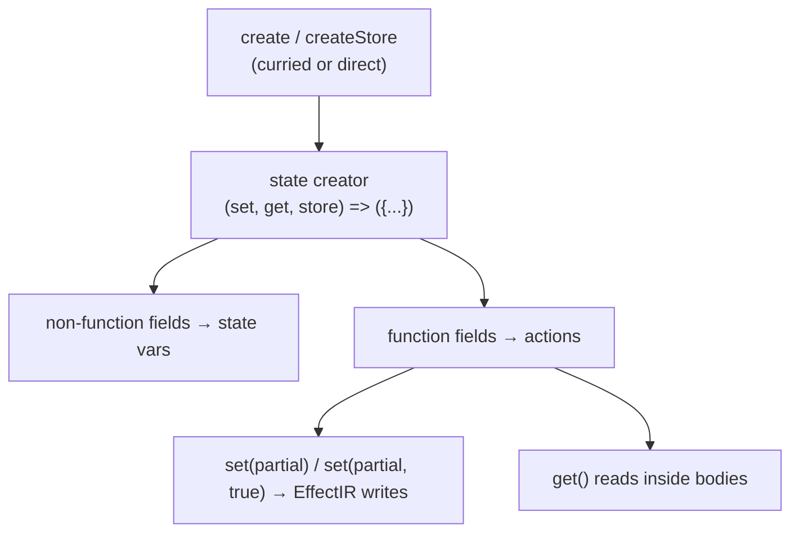

Zustand is a first-class state source. Store **fields** become state variables
(`store:<name>.<field>`); store **actions** become write transitions whose `set(...)`
bodies lower to [structured effects](../concepts/transitions.md). The plugin mirrors the
Jotai slice's structure and supports every Zustand feature that does **not** require a
runtime third-party install.

## What is discovered

- **Store creators** — `create` (`zustand`, `zustand/react`) and `createStore`
  (`zustand`, `zustand/vanilla`), both curried `create<T>()(creator)` and direct
  `create(creator)` forms.
- **State creator** `(set, get, store) => ({ ...state, ...actions })` — non-function
  fields become state vars; function fields become actions.
- **`set` semantics** — shallow partial merge by default; `set(partial, true)` is the
  replace form. `get()` reads inside action bodies and selectors are supported.
- **React read surfaces** — `useStore(s => s.field)` selectors, `useStore.getState()`,
  `store.getState()`, and direct `useStore.setState(...)` / `store.setState(...)`.

## Middleware

Middlewares that wrap the creator are **unwrapped** to find the inner state creator /
initial state:

| Middleware | Handling |
| --- | --- |
| `combine` | unwrapped to inner state |
| `persist` | unwrapped only to find the inner creator; persisted fields get a storage-provenance note + an SSR-safety warning (storage backends, migrations, `partialize`, rehydration are **not** modeled) |
| `devtools` | semantically transparent (unwrap only; no time-travel modeling) |
| `subscribeWithSelector` | transparent |
| `redux` | only static `switch (action.type)` return-object cases are modeled |
| `immer` | **in scope** — see below |

## immer draft mutations

With `zustand/middleware/immer`, `set` takes a draft-mutating function. Statically
analyzable scalar/object mutations are lowered to structured assignments:

- `state.count += 1`, `state.x = v`, `state.obj.k = v` → `EffectIR` assignments.
- Container mutations whose result is not statically determinable
  (`state.list.push(x)`, `.splice`, `.sort`, dynamic index writes,
  `Object.assign(state, …)`) are lowered best-effort or marked **over-approx with a
  warning** — never silently dropped, preserving the
  [E1 invariant](../soundness/e1-invariant.md).

## Observation in replay

Zustand stores are **directly observable**: the harness owns the store, so the generated
test reads `store.getState()` directly — full fidelity, no observation declaration.

## Safety boundaries

Persisted storage timing, async backends, and dynamic container mutations are the edges,
and each surfaces as a typed caveat in the [trust ledger](../soundness/trust-ledger.md)
rather than a silent exact model.
